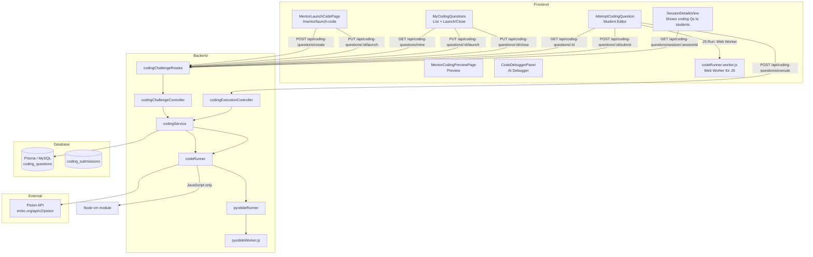
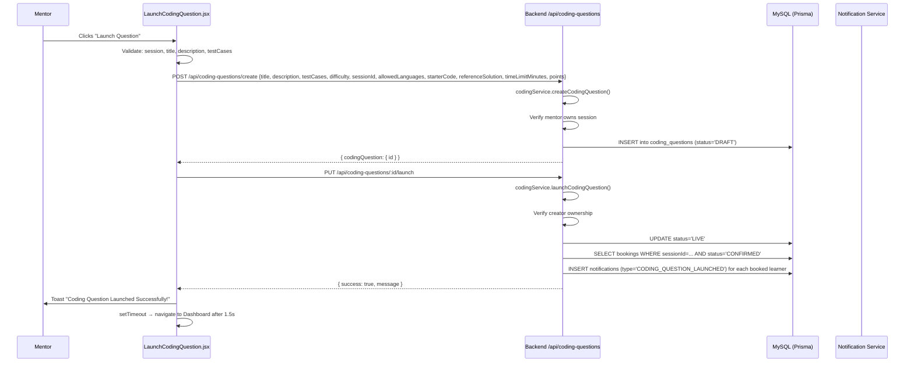
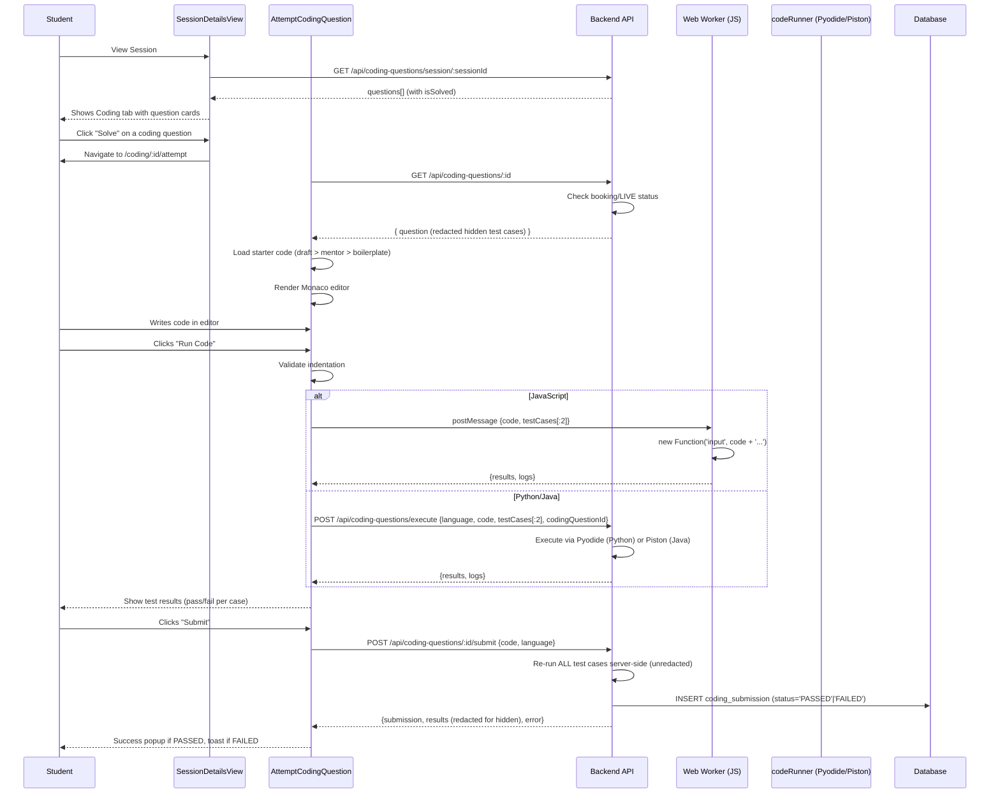
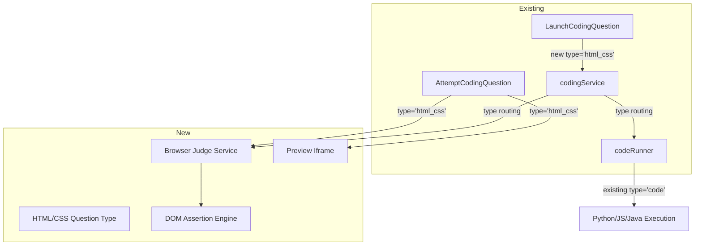

# ZenovaX Coding Question System — Complete Architecture

> **Purpose of this document:** Provide a complete, verified understanding of the existing Coding Question system so another AI (or developer) can add HTML/CSS support without rediscovering the feature from scratch.
>
> **Source of truth:** This document is derived exclusively from actual code in the repository. If documentation conflicts with code, the code wins.
>
> **Do not modify production code based on this document alone.** This is a reference.

----

## Table of Contents

1. [System Architecture Overview](#1-system-architecture-overview)
2. [Mentor: Launch Coding Question](#2-mentor-launch-coding-question)
3. [Question Data Structure](#3-question-data-structure)
4. [Default / Starter Code](#4-default--starter-code)
5. [Student Coding Experience](#5-student-coding-experience)
6. [Code Execution Engine](#6-code-execution-engine)
7. [Test Case Engine](#7-test-case-engine)
8. [Python and JavaScript Implementations](#8-python-and-javascript-implementations)
9. [API Endpoints](#9-api-endpoints)
10. [Database](#10-database)
11. [Security Model](#11-security-model)
12. [File Map](#12-file-map)
13. [Current Limitations](#13-current-limitations)
14. [Structured Question Support](#14-structured-question-support)
15. [Extension Points for HTML/CSS/React](#15-extension-points-for-htmlcssreact)

---

## 1. System Architecture Overview



## 2. Mentor: Launch Coding Question

### Entry Point

- **Route:** `/mentor/launch-code` and `/mentor/launch-code/:id` (edit mode)
- **Wrapper:** `MentorLaunchCodePage.jsx` (`frontend/src/pages/mentor/MentorLaunchCodePage.jsx`) — thin wrapper that reads `mySessions` from `useOutletContext()` (provided by `MentorLayout`) and passes it to `LaunchCodingQuestion`.
- **Core component:** `LaunchCodingQuestion.jsx` (`frontend/src/pages/LaunchCodingQuestion.jsx`)

### All Available Fields (Mentor Creation Form)

| Field | Type | Default | Notes |
|---|---|---|---|
| `selectedSessionId` | string (UUID) | `''` | Dropdown populated from `mySessions` prop. Required. |
| `title` | string | `''` | Question title, e.g. "Reverse a Linked List". Required. |
| `description` | string | `''` | Problem statement (textarea). Required. |
| `difficulty` | `'EASY'` | `'MEDIUM'` | `'MEDIUM'` | Select: Easy / Medium / Hard |
| `points` | number | `100` | Numeric input, min 0 |
| `timeLimitMinutes` | string → number | `''` | Optional, parsed to Number or null. |
| `testCases` | Array | `[{input: '', output: '', isHidden: false}]` | Legacy test case section below |
| `questionType` | `'legacy' | 'structured'` | `'legacy'` | Toggle between input/output and typed function |
| `functionName` | string | `''` | Structured: function name (e.g. `twoSum`) |
| `parameters` | Array | `[{name, type}]` | Structured: typed parameter list |
| `returnType` | string | `'integer'` | Structured: return type (e.g. `integer[]`) |
| `structuredTestCases` | Array | `[{inputs: {}, expected, isHidden}]` | Structured: named-parameter test cases |
| `allowedLanguages` | string[] | `['javascript', 'python', 'java']` | Toggle buttons; at least one required |
| `starterCode` | object | `{javascript: '', python: '', java: ''}` | Per-language code editor (Monaco). Optional. |
| `referenceSolution` | string | `''` | Mentor-only notes, never sent to students |

### Language Selection Behavior

- Three languages defined in `LANGUAGES` constant: `javascript`, `python`, `java`.
- Mentor toggles each on/off. At least one must remain selected.
- When `allowedLanguages` is the full set (`LANGUAGES.length === 3`), the field is sent as `null` to the backend (meaning "all languages").
- When a subset is chosen, the exact array is sent.
- Starter code tabs only show for selected languages.

### Test-Case Creation (Mentor)

- Each test case has:
  - `input` — string (textarea)
  - `output` — string (textarea, "Expected Output")
  - `isHidden` — boolean (toggle button)
- First test case defaults to visible (`isHidden: false`).
- Third+ test cases default to hidden (`isHidden: true`).
- At least one test case with both input and output must exist before save/launch.
- Hidden test cases are labeled "Hidden from students"; visible ones are "Visible sample case".

### Validation Rules (Frontend)

1. A session must be selected.
2. Title and description must be non-empty.
3. At least one test case with non-empty `input` and `output` must exist.
4. No explicit character limits (beyond what backend enforces).

### Save vs Launch

- **Save Draft** → calls `POST /api/coding-questions/create` (or `PUT` for edit), status remains `DRAFT`.
- **Launch Question** → calls create/update first, then immediately calls `PUT /api/coding-questions/:id/launch`, which sets status to `LIVE` and notifies all booked learners.
- After save/launch, navigates back to Dashboard after 1.5 seconds.

### Edit Flow

- When route has `:id`, component loads existing question via `GET /api/coding-questions/:id`.
- If status is `CLOSED`, the form is locked (disabled fieldset) with a yellow banner.
- If status is `LIVE`, only "Save Changes" is shown (no "Launch" button), with a blue banner noting changes apply immediately.
- Test cases, allowedLanguages, and starterCode are all parsed from JSON strings stored in the database.

### Internal Flow When Mentor Clicks "Launch"



---

## 3. Question Data Structure

### TypeScript Interface (derived from actual code)

```typescript
// Frontend form state (LaunchCodingQuestion.jsx)
interface QuestionFormState {
  title: string;
  description: string;
  difficulty: 'EASY' | 'MEDIUM' | 'HARD';
  testCases: TestCaseForm[];
  points: number | string;
  timeLimitMinutes: string | number;
  referenceSolution: string;
}

interface TestCaseForm {
  input: string;
  output: string;
  isHidden: boolean;
}

// API Request Body (POST /api/coding-questions/create)
interface CreateCodingQuestionRequest {
  title: string;                        // required
  description: string;                  // required
  difficulty: string;                   // default 'MEDIUM'
  testCases: Array<{                    // required, at least 1
    input: string;
    output: string;
    isHidden?: boolean;
  }>;
  sessionId: string;                    // required, UUID
  allowedLanguages?: string[] | null;   // null = all 3 languages
  starterCode?: Record<string, string>; // { javascript: '...', python: '...' }
  referenceSolution?: string | null;
  timeLimitMinutes?: number | null;
  points?: number;                      // default 100
}

// Backend representation (codingService.js internal)
// Same as CreateCodingQuestionRequest but testCases, allowedLanguages,
// starterCode, referenceSolution are all JSON-stringified for DB storage.

// Database row (prisma/schema.prisma)
// See model CodingQuestion in section 10 below.

// API Response Body (GET /api/coding-questions/:id)
interface GetCodingQuestionResponse {
  success: true;
  question: {
    id: string;
    title: string;
    description: string;
    testCases: string;                  // JSON string of TestCase[]
    difficulty: string;
    status: 'DRAFT' | 'LIVE' | 'CLOSED';
    sessionId: string;
    creatorId: string;
    allowedLanguages: string | null;    // JSON string or null
    starterCode: string | null;         // JSON string or null
    referenceSolution: string | null;   // REDACTED for non-creator
    timeLimitMinutes: number | null;
    points: number | null;
    createdAt: string;
    updatedAt: string;
    isSolved: boolean;                  // computed: any PASSED submission exists
  };
}
```

### Enum: Difficulty

Not an enum in code — stored as a plain string: `'EASY'`, `'MEDIUM'`, `'HARD'`.

### Enum: Status

Uses `QuizStatus` Prisma enum:

```prisma
enum QuizStatus {
  DRAFT
  LIVE
  CLOSED
}
```

### Test Case Object (canonical shape)

```typescript
interface TestCase {
  input: string;       // The input fed to student's solve()
  output: string;      // Expected output (trim-ignorant comparison)
  isHidden: boolean;   // true = redacted from non-creator
}
```

Test cases travel as a JSON-stringified array in the `testCases` TEXT column.

### Response: Hidden Test-Case Redaction

- Students (`!isPrivileged`): Hidden test cases are replaced with `{ input: 'Hidden', output: 'Hidden', isHidden: true }`.
- Creator/Admin: Full real data is returned.
- Same redaction applies to submission results (actual output replaces 'Wrong Answer' for hidden cases).

### Data Flow Summary

| Layer | Type | Format |
|---|---|---|
| Frontend form | `QuestionFormState` | Plain JS objects |
| API request body | JSON | Plain JS objects (arrays, strings, numbers) |
| Backend (codingService) | JS objects | Parsed, validated |
| Database columns | `testCases`, `allowedLanguages`, `starterCode`, `referenceSolution` | `TEXT` JSON strings |
| API response | JSON | `testCases` as JSON string, others as JSON string or null |
| Student view | After `getCodingQuestionById` | Redacted for hidden test cases |

---

## 4. Default / Starter Code

### Generic Boilerplate (Fallback, defined in `AttemptCodingQuestion.jsx`)

```javascript
// JavaScript:
function solve(input) {
  // Your code here
  return input;
}

# Python:
def solve(input):
    # Your code here
    return input

// Java:
class Solution {
    public static String solve(String input) {
        // Your code here
        return input;
    }
}
```

### Starter Code Flow

1. **Precedence:** Student's cached draft (localStorage) > Mentor-authored starterCode > Generic boilerplate.
2. **Mentor-authored starterCode** is stored per-language in the `starterCode` JSON column.
3. **Student draft** is auto-saved to `localStorage` key `coding-draft-${questionId}-${language}` with 500ms debounce.
4. **Language switch** resets code to the same precedence logic.

### Required Function/Class Structure

### Legacy (default)

All languages require a **single function** named `solve` that accepts a single `input` argument and returns a value.

| Language | Signature | Return type |
|---|---|---|
| JavaScript | `function solve(input) { ... }` | Any (stringified) |
| Python | `def solve(input): ...` | Any (stringified via `str()`) |
| Java | `public static String solve(String input)` | `String` |

### Structured (typed functions)

For `questionType: 'structured'`, the function signature is defined by the mentor:

- `functionName` — the function name (e.g. `twoSum`)
- `parameters` — `[{name: 'nums', type: 'integer[]'}, {name: 'target', type: 'integer'}]`
- `returnType` — e.g. `integer[]`

Starter code is auto-generated from the signature per language. Supported types:

| Type family | Examples |
|---|---|
| Scalar | `integer`, `float`, `string`, `boolean` |
| 1D array | `integer[]`, `float[]`, `string[]`, `boolean[]` |
| 2D array | `integer[][]`, `float[][]`, `string[][]`, `boolean[][]` |

### How Submitted Code Is Combined With Runner Code

#### Legacy
- **JavaScript:** User's raw code is wrapped as `new Function('input', code + '\nreturn solve(input);')` in the web worker. On backend (submit), it's run via `vm.runInContext`.
- **Python:** User's code is prepended with a driver script that iterates inputs, calls `solve(i)`, and prints results separated by `|||` with a `===LOGS_DONE===` delimiter.
- **Java:** User's code (a `Solution` class) is prepended with a `Main` class driver that creates a `Solution` instance, calls `s.solve(input)` for each input, and uses the same `|||` delimiter as Python.

#### Structured
- **JavaScript:** `runStructuredJavaScriptTestCases` in `codeRunner.js` builds a function call using `serializeArgs(functionName, params, inputs, 'javascript')` and evaluates it via `vm.runInContext`.
- **Python/Java:** `buildStructuredDriverCode` in `argSerializer.js` generates a driver that unpacks named inputs from JSON, calls `functionName(**args)` (Python) or `s.functionName(arg1, arg2, ...)` (Java), and serializes results. Output follows the same `===LOGS_DONE===` / `|||` protocol.

### Hidden Boilerplate (Not Visible to User)

- **Python driver** (codeRunner.js `getDriverCode`):
  ```python
  import sys
  import io

  ${userCode}

  def driver():
      user_stdout = io.StringIO()
      old_stdout = sys.stdout
      inputs = [...]
      results = []
      for i in inputs:
          sys.stdout = user_stdout
          try:
              if 'solve' not in globals():
                  sys.stdout = old_stdout
                  results.append("Error: Function 'solve' not found")
                  continue
              res = solve(i)
              sys.stdout = old_stdout
              results.append(str(res))
          except Exception as e:
              sys.stdout = old_stdout
              results.append(f"Error: {str(e)}")
      sys.stdout = old_stdout
      print(user_stdout.getvalue(), end="")
      print("===LOGS_DONE===")
      print("|||".join(results))

  if __name__ == "__main__":
      driver()
  ```

- **Java driver** (codeRunner.js `getDriverCode`):
  ```java
  import java.util.*;
  import java.io.*;

  public class Main {
      public static void main(String[] args) {
          String[] inputs = {...};
          List<String> results = new ArrayList<>();
          PrintStream oldOut = System.out;
          ByteArrayOutputStream userOut = new ByteArrayOutputStream();
          PrintStream newOut = new PrintStream(userOut);
          Solution s = new Solution();
          for (String input : inputs) {
              System.setOut(newOut);
              try {
                  String res = s.solve(input);
                  System.setOut(oldOut);
                  results.add(res);
              } catch (Exception e) {
                  System.setOut(oldOut);
                  results.add("Error: " + e.getMessage());
              }
          }
          System.out.print(userOut.toString());
          System.out.println("===LOGS_DONE===");
          System.out.print(String.join("|||", results));
      }
  }

  ${userCode}
  ```

- **Pyodide worker setup** (pyodideWorker.js): Before running source code, sets up `__name__ = '__main__'` (since the namespace is a bare dict, not a real module) and redirects sys.stdout to an `io.StringIO` for capture.

---

## 5. Student Coding Experience

### Entry Points

- **From Session Details:** `SessionDetailsView.jsx` shows coding questions in a "Coding" tab. "Solve" button navigates to `/coding/:id/attempt`.
- **Direct route:** `/coding/:id/attempt` renders `AttemptCodingQuestion.jsx`.
- **Preview mode:** `/mentor/coding-questions/:id/preview` renders `MentorCodingPreviewPage.jsx` → `AttemptCodingQuestion` with `previewMode=true`.

### Complete Student Lifecycle



### UI Components / Layout

- **Header:** Question title, difficulty badge, "Solved" badge, Format button, Language selector, Run button, Submit button (hidden in preview mode), Zen AI button.
- **Left panel:** Problem description + example test cases (first 2 visible cases).
- **Right panel top:** Monaco Editor.
- **Right panel bottom:** Tabbed output:
  - **Test Results:** Per-case pass/fail. For failed visible cases, shows Expected vs Actual.
  - **Console / Output:** stdout/stderr capture.
  - **Submissions:** History of past submissions (load into editor).
- **Zen AI Debugger:** Slide-over panel (CodeDebuggerPanel.jsx) — connects user's own ChatGPT account via `@openai-oauth/react`. Not related to the core coding question execution.

### Editor

- **Library:** `@monaco-editor/react` (Monaco Editor, same as VS Code).
- **Theme:** `vs-dark`.
- **Language:** Dynamic based on selected language (`javascript`, `python`, `java`).
- **Font:** JetBrains Mono / Fira Code with ligatures.
- **Font size:** 16px.
- **Tab size:** 4 spaces.
- **Keyboard shortcuts:**
  - `Cmd/Ctrl + '` — Run Code
  - `Cmd/Ctrl + Enter` — Submit
  - `Cmd/Ctrl + Shift + F` — Format

### Run Code (Non-Submit)

- Runs the student's current code against **only the first 2 test cases** (visible samples).
- In preview mode, runs against all test cases.
- JavaScript executes **client-side** in a Web Worker (off the main thread).
- Python/Java execute **server-side** via the `/api/coding-questions/execute` endpoint.

### Submit

- Sends code + language to the server.
- Server re-runs ALL test cases (including hidden) and decides PASSED/FAILED server-side.
- Results are redacted for hidden test cases even in the API response.
- Submission is persisted to `coding_submissions` table.

### Restrictions

- Indentation validation: Mixed tabs/spaces is rejected. Python requires 4-space indentation.
- Code length capped at 10,000 characters (backend).
- Test case count capped at 10 (backend).
- Input length capped at 500 characters (backend).
- JavaScript timeout: 3s server-side (submit), 5s client-side (Run).
- Python timeout: 8s (via Pyodide worker).
- Java timeout: implied by Piston API (backend axios timeout: 10s).

### Load / Empty States

- Loading spinner when fetching question.
- "Question not found" if `!question`.
- "Run code to see test results" placeholder in Test Results tab.
- "No console logs to display" in Console tab.
- "No submissions yet" in Submissions tab.

### Error States

- **Not live:** Redirects with toast "This question is not live yet."
- **Network error:** Shows in console output.
- **Indentation error:** Red banner with "Auto-Fix" button.
- **Execution error (worker):** Shows in console, navigates to console tab.
- **Hidden test failure:** No Expected/Actual shown (just "Wrong Answer").

---

## 6. Code Execution Engine

### Overview

Code execution has **two paths**:

| Aspect | JavaScript (Run) | JavaScript (Submit) | Python | Java |
|---|---|---|---|---|
| **Location** | Client (Web Worker) | Server (Node vm) | Server (Pyodide WASM) | Server (Piston API) |
| **Engine** | Dedicated Web Worker | Node.js `vm` module | Pyodide (in worker_thread) | Piston API (external) |
| **Sandbox** | Worker isolation | `vm.createContext` | Worker_thread | External service |
| **Timeout** | 5s (client) / 3s (server) | 3s (vm timeout) | 8s (worker terminate) | 10s (axios timeout) |

### JavaScript Execution (Client-side "Run")

**File:** `frontend/src/workers/codeRunner.worker.js`

```mermaid
flowchart LR
    A[AttemptCodingQuestion] -->|postMessage {code, testCases}| B[Web Worker]
    B --> C[for each test case: new Function]
    C --> D[result = userFunc(tc.input)]
    D --> E{Compare actual.trim() === expected}
    E -->|pass| F[{passed: true}]
    E -->|fail| G[{passed: false}]
    B -->|postMessage {results, logs}| A
    A --> H{5s timeout?}
    H -->|yes| I[worker.terminate]
    H -->|no| A[receive results]
```

### JavaScript Execution (Server-side "Submit")

**File:** `backend/services/codeRunner.js` — function `runJavaScriptTestCases()`

```javascript
const sandbox = { console: { log: captureLog, error: captureLog, warn: captureLog } };
const context = vm.createContext(sandbox);
vm.runInContext(userCode, context, { timeout: JS_TIMEOUT_MS, displayErrors: true });
// Then for each input:
vm.runInContext('solve(__input__)', context, { timeout: JS_TIMEOUT_MS });
```

### Python Execution

**Files:** `pyodideRunner.js` + `pyodideWorker.js`

```mermaid
flowchart TB
    A[codeRunner.runTestCases] -->|language='python'| B[getDriverCode]
    B --> C[pyodideRunner.executePython]
    C --> D[worker.postMessage {id, sourceCode}]
    D --> E[pyodideWorker.js receives message]
    E --> F[loadPyodide (cached)]
    F --> G[pyodide.runPython(sourceCode)]
    G --> H[capture stdout]
    H --> I[worker.postMessage {id, result: {stdout, stderr}}]
    I --> J[codeRunner parses stdout]
    J --> K[split by '===LOGS_DONE===' and '|||']
```

Key details:
- Pyodide is a full CPython compiled to WebAssembly.
- Loaded once (~14MB, takes a couple of seconds); shared across requests.
- Runs in a worker_thread so infinite loops don't freeze the server.
- On timeout, the worker is terminated and a new one is spawned.
- `__name__ = '__main__'` is set manually because Pyodide namespaces are bare dicts.

### Java Execution

**Files:** `codeRunner.js` → `executePiston()`

- Uses the public Piston API at `https://emkc.org/api/v2/piston/execute` (configurable via `PISTON_API_URL` env var).
- Request format:
  ```json
  {
    "language": "java",
    "version": "*",
    "files": [{ "name": "solution", "content": "..." }],
    "stdin": ""
  }
  ```
- Response parsed for `run.stdout`, `run.stderr`, `run.code` (exit code).
- 503 error if Piston is unavailable.
- Note: Piston went whitelist-only — this is a known limitation mentioned in the code comments.

### Execution Request Validation (backend)

```javascript
const MAX_CODE_LENGTH = 10000;     // characters
const MAX_TEST_CASES = 10;
const MAX_INPUT_LENGTH = 500;       // characters per input
const JS_TIMEOUT_MS = 3000;        // server-side JS vm timeout
// Python timeout is 8000ms (in pyodideRunner.js)
// Overall axios timeout for Piston is 10000ms
```

### Result Comparison

#### Legacy (string-based)
All results are compared using:
```javascript
actual.trim() === String(expected).trim()
```

This means:
- **Whitespace:** Leading/trailing whitespace is ignored (`.trim()` on both sides).
- **Newlines:** `\n` is stripped from actual output before comparison in the backend: `actual.replace(/\n/g, '')`. In the web worker, `trim()` is used.
- **Type handling:** Everything is converted to String. Objects are `JSON.stringify`'d in the worker; Python results use `str()`.
- **Case sensitivity:** Preserved (no `.toLowerCase()`).

#### Structured (typed comparison)
For `questionType: 'structured'`, results are compared using `typedCompare()` in `backend/services/typedComparator.js`:

| Type | Comparison |
|---|---|
| `integer` | `Number(actual) === Number(expected)` |
| `float` | `Math.abs(actual - expected) < 1e-6` |
| `string` | Exact match |
| `boolean` | `Boolean(actual) === Boolean(expected)` |
| `integer[]` | Deep equality, order-sensitive |
| `float[]` | Deep equality, ε = 1e-6 per element |
| `string[]` / `boolean[]` | Deep equality, order-sensitive |
| 2D arrays | Recursive deep equality |

44 unit tests in `backend/tests/typedComparator.test.js` cover all types, edge cases (NaN, empty arrays, boundary epsilon), and negative numbers.

---

## 7. Test Case Engine

### Schema

Individual test case object:

```typescript
interface TestCase {
  input: string;       // Raw input string
  output: string;      // Expected output string
  isHidden: boolean;   // Whether hidden from non-creator
}
```

Stored as JSON-stringified array in the `testCases` `@db.Text` column.

### Complete Test Flow

```mermaid
flowchart LR
    subgraph Mentor
        A[Mentor creates test cases] -->|JSON.stringify| B[(DB: coding_questions.testCases)]
    end

    subgraph API
        B --> C{codingService<br/>getCodingQuestionById}
        C -->|isPrivileged?| D[Full test cases]
        C -->|not privileged| E[redactHiddenTestCases]
        E --> F[Visible: real data<br/>Hidden: {input:'Hidden', output:'Hidden'}]
    end

    subgraph Student
        F --> G[Student sees visible cases]
        G --> H[Student writes code]
        H --> I[Run: only first 2 cases]
        H --> J[Submit: ALL cases sent to server]
    end

    subgraph Execution
        J --> K[codeRunner.runTestCases]
        K --> L[For each test case:]
        L --> M[Run code with tc.input]
        M --> N[Get actual output]
        N --> O{actual.trim() === expected.trim()}
        O -->|yes| P[passed: true]
        O -->|no| Q[passed: false]
        P --> R[redactHiddenResults]
        Q --> R
        R --> S[Student sees redacted results]
    end
```

### Concrete Example

#### Mentor creates:

```json
[
  { "input": "5", "output": "25", "isHidden": false },
  { "input": "10", "output": "100", "isHidden": false },
  { "input": "0", "output": "0", "isHidden": true },
  { "input": "-3", "output": "9", "isHidden": true }
]
```

#### Student code (Python):

```python
def solve(input):
    n = int(input)
    return n * n
```

#### Runner/driver combines into:

```python
# ... driver code ...
def solve(input):
    n = int(input)
    return n * n
# ... calls solve for each input ...
```

#### Execution (per test case):

| Input | Expected | Actual | Pass? |
|---|---|---|---|
| `"5"` | `"25"` | `"25"` | PASS |
| `"10"` | `"100"` | `"100"` | PASS |
| `"0"` | `"0"` | `"0"` | PASS |
| `"-3"` | `"9"` | `"9"` | PASS |

#### Normalization:

- Python: `str(n * n)` → `"25"`
- JavaScript: `String(result)` → `"25"`
- Both sides trimmed: `"25".trim() === "25".trim()`
- Newlines removed from actual: `actual.replace(/\n/g, '')`

#### Hidden test cases in student response:

```json
[
  { "input": "5", "expected": "25", "actual": "25", "passed": true, "isHidden": false },
  { "input": "10", "expected": "100", "actual": "100", "passed": true, "isHidden": false },
  { "input": "Hidden", "expected": "Hidden", "actual": "Hidden", "passed": true, "isHidden": true },
  { "input": "Hidden", "expected": "Hidden", "actual": "Hidden", "passed": true, "isHidden": true }
]
```

### Pass/Fail Calculation

A submission is `PASSED` only if:
```javascript
const status = !error && results && results.length > 0 && results.every(r => r.passed)
    ? 'PASSED'
    : 'FAILED';
```

**All test cases must pass.** There is no partial credit concept.

---

## 8. Python and JavaScript Implementations

### Python

- **Solution function:** `def solve(input):`
- **Execution:** Pyodide (WASM CPython) in backend worker_thread
- **Driver:** Python script wrapping user code, capturing stdout, iterating over `JSON.stringify(inputs)`, calling `solve(i)`, printing `str(res)` for each, delimited by `|||`
- **Runner file:** `backend/services/pyodideRunner.js` + `backend/services/pyodideWorker.js`
- **Dependency:** `pyodide` npm package (version `^314.0.2`)

### JavaScript

- **Solution function:** `function solve(input) { ... }`
- **Client-side Run:** Web Worker (`frontend/src/workers/codeRunner.worker.js`)
- **Server-side Submit:** Node `vm` module (`backend/services/codeRunner.js` — `runJavaScriptTestCases`)
- **No driver wrapper needed** — code is evaluated and `solve` is called directly
- **Console capture:** `sandbox.console = { log: captureLog, error: captureLog, warn: captureLog }`

### Java (partially supported but not fully functional)

- **Solution class:** `class Solution { public static String solve(String input) { ... } }`
- **Execution:** Piston API (external service)
- **Driver:** `Main` class wrapping user code, same `|||` delimiter pattern as Python
- **Note:** Java is listed as a supported language in the frontend UI but Piston went whitelist-only, so Java execution may fail in production.

### Shared Logic (Language-Agnostic)

All in `backend/services/codeRunner.js`:

| Function | Purpose |
|---|---|
| `validateRunInput()` | Validates code length, test cases count, input lengths |
| `getDriverCode()` | Generates wrapper code for Python and Java |
| `runTestCases()` | Main orchestrator — calls language-specific executor, parses results, compares |
| Result comparison | `actual.trim() === String(expected).trim()` + `actual.replace(/\n/g, '')` |

### Key Differences

| Aspect | JS (Run) | JS (Submit) | Python | Java |
|---|---|---|---|---|
| Where | Browser | Server (vm) | Server (Pyodide) | Server (Piston) |
| Isolation | Web Worker | vm.createContext | worker_thread | External API |
| Timeout | 5s client | 3s | 8s | ~10s |
| Wrapper | `new Function()` | vm.runInContext | Python driver script | Java Main class |
| Console | Worker capture | Sandbox capture | stdout capture | stdout capture |
| File | codeRunner.worker.js | codeRunner.js | pyodideRunner+Worker | codeRunner.js |
| External dep? | No | No | Pyodide npm | Piston API |

---

## 9. API Endpoints

All endpoints are under `/api/coding-questions` unless noted.

### Question Management (Mentor)

| Method | Path | Purpose | Auth | Body |
|---|---|---|---|---|---|
| `POST` | `/create` | Create draft | Mentor/Both | `{title, description, difficulty, testCases, sessionId, allowedLanguages?, starterCode?, referenceSolution?, timeLimitMinutes?, points?, questionType?, functionName?, parameters?, returnType?, structuredTestCases?}` |
| `PUT` | `/:id` | Update draft/live | Mentor/Both (owner) | Same as create (partial) |
| `PUT` | `/:id/launch` | Set LIVE + notify | Mentor/Both (owner) | — |
| `PUT` | `/:id/close` | Set CLOSED | Mentor/Both (owner) | — |
| `GET` | `/mine` | List own questions | Mentor/Both | — |
| `GET` | `/session/:sessionId` | List questions for session | Any authenticated | — |

### Execution (Student)

| Method | Path | Purpose | Auth | Body |
|---|---|---|---|---|
| `GET` | `/:id` | Get question details | Any authenticated (booked) | — |
| `POST` | `/execute` | Run code (non-submit) | Any authenticated (booked) | `{language, code, testCases, codingQuestionId}` |
| `POST` | `/:id/submit` | Submit final answer | Any authenticated (booked) | `{code, language}` |
| `GET` | `/:id/submissions/mine` | Own submission history | Any authenticated (booked) | — |

### Response Formats

All endpoints return:
```json
{ "success": true, ... }
```

Errors return:
```json
{ "error": "message" }
```

### Caller Mapping

| Frontend Component | Endpoint Called | Method |
|---|---|---|
| `LaunchCodingQuestion.jsx` | `/create` | `POST` |
| `LaunchCodingQuestion.jsx` | `/:id` | `PUT` |
| `LaunchCodingQuestion.jsx` | `/:id/launch` | `PUT` |
| `MyCodingQuestions.jsx` | `/mine` | `GET` |
| `MyCodingQuestions.jsx` | `/:id/launch` | `PUT` |
| `MyCodingQuestions.jsx` | `/:id/close` | `PUT` |
| `AttemptCodingQuestion.jsx` | `/:id` | `GET` |
| `AttemptCodingQuestion.jsx` | `/execute` | `POST` |
| `AttemptCodingQuestion.jsx` | `/:id/submit` | `POST` |
| `AttemptCodingQuestion.jsx` | `/:id/submissions/mine` | `GET` |
| `SessionDetailsView.jsx` | `/session/:sessionId` | `GET` |

---

## 10. Database

### Prisma Model: `CodingQuestion`

```prisma
model CodingQuestion {
  id              String        @id @default(uuid())

  // References
  creatorId       String
  creator         User          @relation(fields: [creatorId], references: [id], onDelete: Cascade)
  sessionId       String
  session         Session       @relation(fields: [sessionId], references: [id], onDelete: Cascade)

  // Details
  title           String
  description     String        @db.Text
  testCases       String        @db.Text     // JSON: [{input, output, isHidden}]
  difficulty      String        @default("MEDIUM")

  // Authoring extras (optional, backward-compatible)
  allowedLanguages   String?    @db.Text     // JSON array or null
  starterCode        String?    @db.Text     // JSON map or null
  referenceSolution  String?    @db.Text
  timeLimitMinutes   Int?
  points             Int?       @default(100)

  // Structured question fields (2026-07-25 migration)
  questionType          String?   @default("legacy")  // "legacy" | "structured"
  functionName          String?                       // e.g. "twoSum"
  parameters            String?    @db.Text           // JSON: [{name, type}]
  returnType            String?                       // e.g. "integer[]"
  structuredTestCases   String?    @db.Text           // JSON: [{inputs, expected, isHidden}]

  // Status
  status          QuizStatus    @default(DRAFT)

  // Timestamps
  createdAt       DateTime      @default(now())
  updatedAt       DateTime      @updatedAt

  // Relations
  submissions     CodingSubmission[]

  @@index([creatorId])
  @@index([sessionId])
  @@map("coding_questions")
}
```

### Prisma Model: `CodingSubmission`

```prisma
model CodingSubmission {
  id               String         @id @default(uuid())

  userId           String
  user             User           @relation(fields: [userId], references: [id], onDelete: Cascade)
  codingQuestionId String
  codingQuestion   CodingQuestion @relation(fields: [codingQuestionId], references: [id], onDelete: Cascade)

  code             String         @db.Text
  language         String
  status           String         // 'PASSED' | 'FAILED'

  createdAt        DateTime       @default(now())

  @@index([userId])
  @@index([codingQuestionId])
  @@index([userId, codingQuestionId])
  @@map("coding_submissions")
}
```

### Relationships

```
User (creatorId) ──1:N──> CodingQuestion
Session (sessionId) ──1:N──> CodingQuestion
CodingQuestion ──1:N──> CodingSubmission
User (userId) ──1:N──> CodingSubmission
```

### Fields NOT Persisted (Computed at Response Time)

- `isSolved` — computed by checking if any `CodingSubmission` with `status: 'PASSED'` exists for the user+question.
- `submissionCount` — computed as `_count.submissions`.

### Notification Type

Added: `CODING_QUESTION_LAUNCHED` in `NotificationType` enum. Notifications are created with this type when a coding question is launched.

---

## 11. Security Model

### Authentication

- All coding question endpoints require JWT-based authentication via `protect` middleware.
- JWT is stored in an httpOnly cookie (`token`) or `Authorization: Bearer` header.
- Token verified with `jose.jwtVerify()`.

### Authorization

| Endpoint | Role Gate |
|---|---|
| `/create`, `/:id`, `/:id/launch`, `/:id/close`, `/mine` | `MENTOR` or `BOTH` only |
| `/execute`, `/:id`, `/:id/submit`, `/:id/submissions/mine`, `/session/:sessionId` | Any authenticated user |

### Access Control for Students

The `assertCanAccessCodingQuestion` function in `codingService.js` enforces:

1. **Ownership bypass:** The creator (mentor) and ADMIN can access any live question.
2. **Booking check:** Non-creator/non-admin must have a `CONFIRMED` or `COMPLETED` booking for the associated session.
3. **LIVE status:** For executions and submissions, the question must be `LIVE`.

### CSRF Protection

- Double-submit cookie pattern: CSRF token in cookie must match `X-CSRF-Token` header.
- Exemptions for GET/HEAD/OPTIONS, public auth endpoints, and requests without a session cookie.
- Bearer-token-only requests bypass CSRF (no cookie to abuse).

### Hidden Test Case Leakage Prevention

- `redactHiddenTestCases()` replaces hidden input/output with `'Hidden'` before sending to non-privileged users.
- `redactHiddenResults()` does the same for execution results; hidden-case actual output is replaced with `'Wrong Answer'` on failure.
- Even though the client displays redacted versions, the raw API response is also redacted.

### Code Execution Security

- **JavaScript (client):** Runs in a Web Worker — isolated from the DOM/main thread. Worker is terminated on timeout.
- **JavaScript (server):** Node `vm` module — provides synchronous runtime isolation but **not** a hardened security sandbox. Code comment explicitly states: "adequate for catching accidental infinite loops / runtime errors in student solutions, not for running fully untrusted adversarial code."
- **Python:** Runs in a worker_thread with Pyodide WASM — naturally sandboxed by the WASM runtime. Worker terminated on timeout.
- **Java:** Runs on the Piston API (external) — sandboxing is Piston's responsibility.
- **Rate limiting:** 100 requests/minute general limit. 
- **Payload limits:** Express JSON body parser limited to 50kb. Code length capped at 10,000 chars. Input length capped at 500 chars.

### Weaknesses (Not Fixed, Per Code Comments)

1. **VM sandbox escape:** The `vm` module is not a security boundary. Malicious JS could potentially escape.
2. **No filesystem/network restrictions** for Piston (external service responsibility).
3. **No memory limits** enforced by the app (Pyodide/VM have implicit limits).
4. **Reference solution stored** in database (mentor-only field, but reviewer/DB admin could see it).
5. **All hidden test cases stored** in the same JSON blob — a DB leak exposes everything.
6. **No attempt count limit** — students can submit unlimited times (though each submission is persisted).

---

## 12. File Map

### Frontend Files

| File | Purpose |
|---|---|
| `frontend/src/pages/LaunchCodingQuestion.jsx` | Mentor form: create/edit/launch coding questions |
| `frontend/src/pages/mentor/MentorLaunchCodePage.jsx` | Thin wrapper for LaunchCodingQuestion with mentor context |
| `frontend/src/pages/mentor/MentorCodingQuestionsPage.jsx` | Thin wrapper for MyCodingQuestions |
| `frontend/src/pages/mentor/MentorCodingPreviewPage.jsx` | Thin wrapper for AttemptCodingQuestion in preview mode |
| `frontend/src/pages/learner/AttemptCodingQuestion.jsx` | Student coding editor, run, submit, results |
| `frontend/src/components/dashboard/mentor/MyCodingQuestions.jsx` | Mentor's question list with launch/close/preview/edit |
| `frontend/src/components/dashboard/learner/SessionDetailsView.jsx` | Student session page showing coding questions |
| `frontend/src/components/CodeDebuggerPanel.jsx` | AI debugger panel (ChatGPT-powered, separate from execution) |
| `frontend/src/workers/codeRunner.worker.js` | Web Worker for client-side JS execution |
| `frontend/src/utils/api.js` | API client (`apiCall` function). CSRF, auth, retry logic. |
| `frontend/src/App.jsx` | Router: all coding question routes defined here |
| `frontend/src/layouts/MentorLayout.jsx` | Provides `mySessions` context to child routes |
| `frontend/src/pages/mentor/MentorSessionDetailsPage.jsx` | Mentor views session (reuses Student SessionDetailsPage) |

### Backend Files

| File | Purpose |
|---|---|
| `backend/routes/codingChallengeRoutes.js` | All coding question routes (17 lines) |
| `backend/controllers/codingChallengeController.js` | Controller: delegates to codingService (82 lines) |
| `backend/controllers/codingExecutionController.js` | Controller for `/execute` endpoint (13 lines) |
| `backend/services/codingService.js` | Core business logic: CRUD, access control, submission, execution orchestration (512 lines) |
| `backend/services/codeRunner.js` | Execution engine: driver code generation, Piston API, vm runner, test comparison, structured runner (363 lines) |
| `backend/services/typedComparator.js` | Type-aware comparison engine (~100 lines) |
| `backend/services/argSerializer.js` | Value/call serialization and driver code generation (~148 lines) |
| `backend/services/starterCodeGenerator.js` | Starter code generation per language (~60 lines) |
| `backend/services/questionTypeEngine.js` | Orchestrator and validation (~82 lines) |
| `backend/tests/typedComparator.test.js` | 44 unit tests for typed comparison (~200 lines) |
| `backend/services/pyodideRunner.js` | Pyodide worker pool manager (87 lines) |
| `backend/services/pyodideWorker.js` | Pyodide worker_thread: loads Pyodide, runs Python, returns stdout (67 lines) |
| `backend/middleware/auth.js` | JWT auth and role authorization |
| `backend/middleware/csrf.js` | CSRF double-submit cookie protection |
| `backend/middleware/rateLimiter.js` | Rate limiting (100 req/min general) |
| `backend/utils/errors.js` | Error classes: BadRequestError, ForbiddenError, NotFoundError, ConflictError |
| `backend/utils/validation.js` | Email/password/URL validation utilities |
| `backend/server.js` | Express app setup, middleware, route mounting |
| `backend/utils/db.js` | Prisma client with soft-delete extension |

### Database

| File | Purpose |
|---|---|
| `backend/prisma/schema.prisma` | All models: CodingQuestion, CodingSubmission, User, Session, etc. |

### Dependencies (relevant)

| Package | Used By | Purpose |
|---|---|---|
| `@monaco-editor/react` | Frontend | Code editor |
| `pyodide` | Backend | Python WASM interpreter |
| `vm` (Node built-in) | Backend | Server-side JS execution |
| `axios` | Backend | Piston API calls |
| `@prisma/client` | Backend | Database ORM |
| `jose` | Backend | JWT verification |

---

## 13. Current Limitations

### Why Python/JavaScript but NOT HTML/CSS

The current architecture makes fundamental assumptions that prevent HTML/CSS questions:

1. **Single-function input/output model:** All languages require a `solve(input)` function that takes a string and returns a value. HTML/CSS questions have no such function — they involve rendering a visual result.

2. **String-based comparison:** Test cases compare `actual.trim() === expected.trim()`. HTML/CSS output isn't a simple string — it's a rendered DOM with computed styles.

3. **No browser/DOM environment:** JavaScript runs in either a Web Worker (no DOM) or Node `vm` (no DOM). There is no browser/headless-browser execution path.

4. **No visual diff engine:** The system has no way to compare rendered HTML/CSS output (screenshot diffing, computed style comparison, responsive layout checking).

5. **No assertion framework:** Test cases are input→output pairs. There's no concept of "check that this element has this CSS property" or "verify the layout at 768px width."

6. **Python vs JS shared assumptions:** Both follow the same `solve(input)` → `output` pattern. The driver-wrapper pattern (prepare inputs, call `solve` for each, collect results) is the same. HTML/CSS breaks this completely.

### Other Limitations

- **No partial credit:** All-or-nothing pass/fail. No per-test-case scoring.
- **Java may be broken:** Piston API went whitelist-only. Java execution may fail.
- **No attempt limits:** Students can submit unlimited times.
- **No plagiarism detection.**
- **No multi-file support:** Each question has one editor, one file.
- **No import/library management:** Students can only use standard library.
- **No rich test case types:** Legacy input/output are plain strings. Structured questions add typed parameters and expected values (arrays, nested arrays, numbers, booleans).
- **No performance metrics:** No runtime measurement, memory measurement, or big-O analysis.
- **Pyodide memory:** ~14MB loaded once, but long-running Python scripts with large data could exhaust memory.
- **VM security:** The Node `vm` module is explicitly noted as "not a hardened security sandbox."
- **No test case editing after launch** warning — mentor can edit test cases while question is live (changes apply immediately to students).

---

## 14. Structured Question Support

### Overview

Structured questions extend the legacy `solve(input)` model with typed function signatures, named parameters, type-aware comparison, and automatic starter code generation — all while maintaining full backward compatibility.

### Architecture

```
┌─────────────────────────────────────────────────────────┐
│                   questionTypeEngine.js                  │
│  (Orchestrator — pure functions, no execution engine)    │
├──────────────┬────────────────┬─────────────────────────┤
│ typedComp-   │  argSerializer │  starterCodeGenerator    │
│ arator.js    │  .js           │  .js                     │
│ (comparison) │ (serialization │ (starter code per lang)  │
│              │  + driver gen) │                          │
└──────────────┴────────────────┴─────────────────────────┘
```

### Engine-Agnostic Layer

All three modules are pure functions with zero dependencies on `vm`, Pyodide, or Piston:

| Module | Function | Purpose |
|---|---|---|
| `typedComparator.js` | `typedCompare(expected, actual, type)` | Returns boolean |
| `argSerializer.js` | `serializeValue(value, type, language)` | Serializes typed value to JS/Python/Java literal |
| `argSerializer.js` | `serializeArgs(functionName, params, inputs, language)` | Builds `functionName(arg1, arg2, ...)` call string |
| `argSerializer.js` | `buildStructuredDriverCode(language, userCode, functionName, params, testCases)` | Generates Python/Java driver wrapper for structured execution |
| `starterCodeGenerator.js` | `generateStarterCode(functionName, params, returnType, language)` | Generates student starter function stub |

### Backend Integration

- **`codingService.js`**: `createCodingQuestion`, `updateCodingQuestion`, `getCodingQuestionById` pass through structured fields. `submitCodingQuestion` and `executeCode` route to `runStructuredTestCases` when `questionType === 'structured'`.
- **`codeRunner.js`**: `runStructuredTestCases()` handles JS via `vm` with `serializeArgs`, Python/Java via `buildStructuredDriverCode`. Results use `typedCompare()` instead of string equality.
- **Hidden test case redaction**: Separate `redactHiddenStructuredTestCases()` / `redactHiddenStructuredResults()` functions for structured format.

### Frontend Integration

- **`LaunchCodingQuestion.jsx`**: Question type toggle (legacy/structured). Structured mode shows function signature builder, typed parameter editor, structured test case inputs.
- **`AttemptCodingQuestion.jsx`**: Detects structured vs legacy. Shows typed function signature. Auto-generates starter code from signature. Sends `isStructured` + `functionName` + `parameters` + `returnType` to the web worker and API.
- **`codeRunner.worker.js`**: Handles `isStructured` flag: builds function call with named args, uses `typedCompare` inline for pass/fail.

### New Files

| File | Lines | Purpose |
|---|---|---|
| `backend/services/typedComparator.js` | ~100 | Type-aware comparison engine |
| `backend/services/argSerializer.js` | ~148 | Value/call serialization + driver code gen |
| `backend/services/starterCodeGenerator.js` | ~60 | Starter code generation per language |
| `backend/services/questionTypeEngine.js` | ~82 | Orchestrator + validation |
| `backend/tests/typedComparator.test.js` | ~200 | 44 unit tests |

## 15. Extension Points for HTML/CSS/React

### What Would Need to Change

Adding HTML/CSS support would require either:

**Option A: String-based output comparison (simplistic, limited)**
- Add a new language type `html`/`css`/`htmlcss`.
- Student code would still use `solve(input)` but return an HTML string.
- Test cases would compare the rendered HTML string against expected HTML.
- **Limitation:** Cannot test CSS styling, computed styles, responsive layout, or interactivity.

**Option B: Browser-based execution engine (full fidelity)**
This is the more realistic approach.

### Reusable Components

| Component | Reusable? | Notes |
|---|---|---|
| `LaunchCodingQuestion.jsx` | **Partially** | Form fields (title, description, difficulty, points) are reusable. Test case UI would need extension. Language selector could include HTML/CSS. |
| `AttemptCodingQuestion.jsx` | **Partially** | Editor, header, output tabs are reusable. New output tab needed for rendered preview. |
| `MyCodingQuestions.jsx` | **Yes** | No changes needed — list/view/launch/close works for any question type. |
| `codeRunner.js` | **No** | New runner needed for HTML/CSS. |
| `codingService.js` | **Mostly** | CRUD logic is reusable. Execution orchestration needs extension. |
| `CodingQuestion` model | **Mostly** | Add a `type` field (e.g. `'code' | 'html_css'`). |
| `CodingSubmission` model | **Mostly** | Add a `type` field. |

### New Components Needed

1. **Browser Judge Service** — A headless browser (Puppeteer/Playwright) service that:
   - Renders the student's HTML/CSS in a real browser.
   - Executes test assertions against the DOM.
   - Returns pass/fail for each assertion.

2. **DOM Assertion Types** — New test case types:
   - `elementExists(selector)`
   - `hasText(selector, text)`
   - `hasCssProperty(selector, property, value)`
   - `matchesLayout(screenshot)`
   - `isResponsive(breakpoint)`

3. **Preview Iframe** — In the student UI, an iframe rendering the live HTML/CSS output alongside the editor.

4. **Mentor Test Case UI** — New test case form allowing:
   - DOM element selectors
   - CSS property assertions
   - Responsive breakpoint configuration
   - Visual snapshot baselines

### Architecture Recommendations



### Which Files Would Change

| File | Change |
|---|---|
| `LaunchCodingQuestion.jsx` | Add HTML/CSS language option, new test-case assertion types |
| `AttemptCodingQuestion.jsx` | Add preview iframe, new output tab for visual results |
| `codeRunner.js` | Add `runHTMLCSSTestCases()` or route to Browser Judge |
| `codingService.js` | Route execution by question type |
| `prisma/schema.prisma` | Add `type` field to CodingQuestion, potentially new assertion model |
| `codingChallengeRoutes.js` | Potentially add HTML-specific endpoints |
| `codeRunner.worker.js` | Unchanged (JS-only Web Worker) |

### New Files Needed

| File | Purpose |
|---|---|
| `backend/services/browserJudge.js` | Headless browser execution service |
| `backend/services/domAssertions.js` | DOM assertion comparison engine |
| `frontend/components/PreviewFrame.jsx` | Live HTML preview iframe component |
| Story-specific assertion schemas | New test case types |

---

## Appendix: Key Code Snippets

### Result Comparison (the single source of truth for pass/fail)

```javascript
// backend/services/codeRunner.js — runTestCases(), line 218-226
const results = testCases.map((tc, index) => {
    const actual = rawOutputs[index] !== undefined ? rawOutputs[index].replace(/\n/g, '') : 'No Output';
    return {
        input: tc.input,
        expected: tc.output,
        actual,
        passed: actual.trim() === String(tc.output).trim()
    };
});
```

### Hidden Test Case Redaction

```javascript
// backend/services/codingService.js — line 24-31
const redactHiddenResults = (results, testCases, isPrivileged) => {
    if (!results || isPrivileged) return results;
    return results.map((r, index) => (
        isTestCaseHidden(testCases[index], index)
            ? { input: 'Hidden', output: 'Hidden', expected: 'Hidden', actual: r.passed ? 'Hidden' : 'Wrong Answer', passed: r.passed, isHidden: true }
            : { ...r, isHidden: false }
    ));
};
```

### Web Worker JS Runner (client-side)

```javascript
// frontend/src/workers/codeRunner.worker.js
// Now handles both legacy and structured:
self.onmessage = (e) => {
    const { code, testCases, functionName, parameters, returnType, isStructured } = e.data;
    // For each test case:
    if (isStructured) {
        const paramNames = parameters.map(p => p.name).join(', ');
        userFunc = new Function(...parameters.map(p => p.name), code + `\nreturn ${functionName}(${paramNames});`);
        const args = parameters.map(p => serializeValue(tc.inputs[p.name], p.type));
        result = userFunc(...args);
        passed = typedCompare(tc.expected, actualVal, returnType);
    } else {
        userFunc = new Function('input', code + '\nreturn solve(input);');
        result = userFunc(tc.input);
        passed = userOutput.trim() === expectedVal;
    }
};
```

### Driver Code Generation

```javascript
// backend/services/codeRunner.js — line 12-91
const getDriverCode = (language, userCode, testCases) => {
    if (language === 'python') {
        // Returns Python script wrapping userCode with driver()
        // that calls solve(i) for each input
    }
    if (language === 'java') {
        // Returns Java Main class wrapping user's Solution class
    }
    return userCode; // JavaScript — no wrapper needed
};
```

---

> **End of document.**
>
> Total lines of code verified across all relevant files: ~6,500+ across 20+ files.
> This document was generated by analyzing the actual codebase — not by guessing or assuming.
