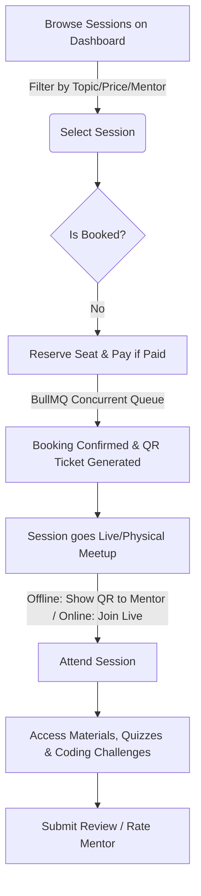
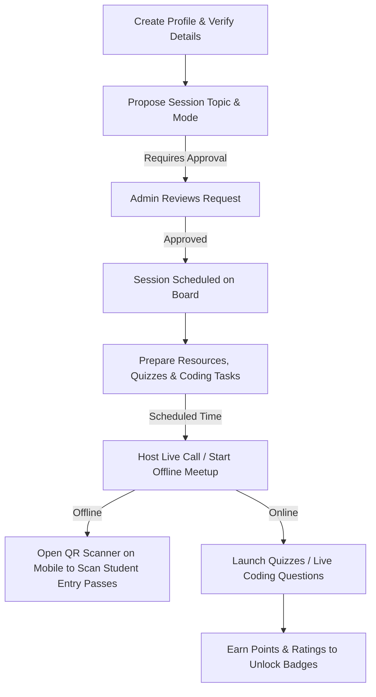
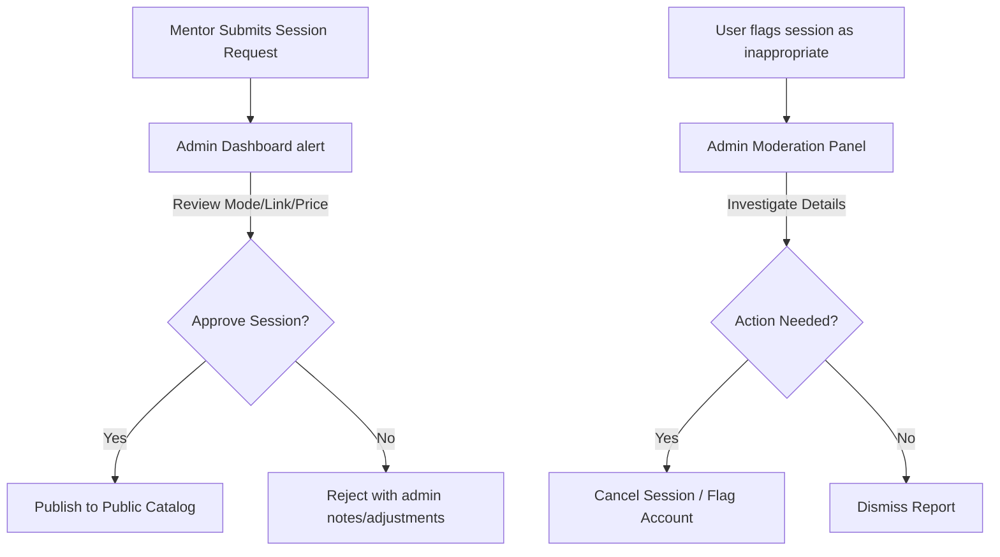
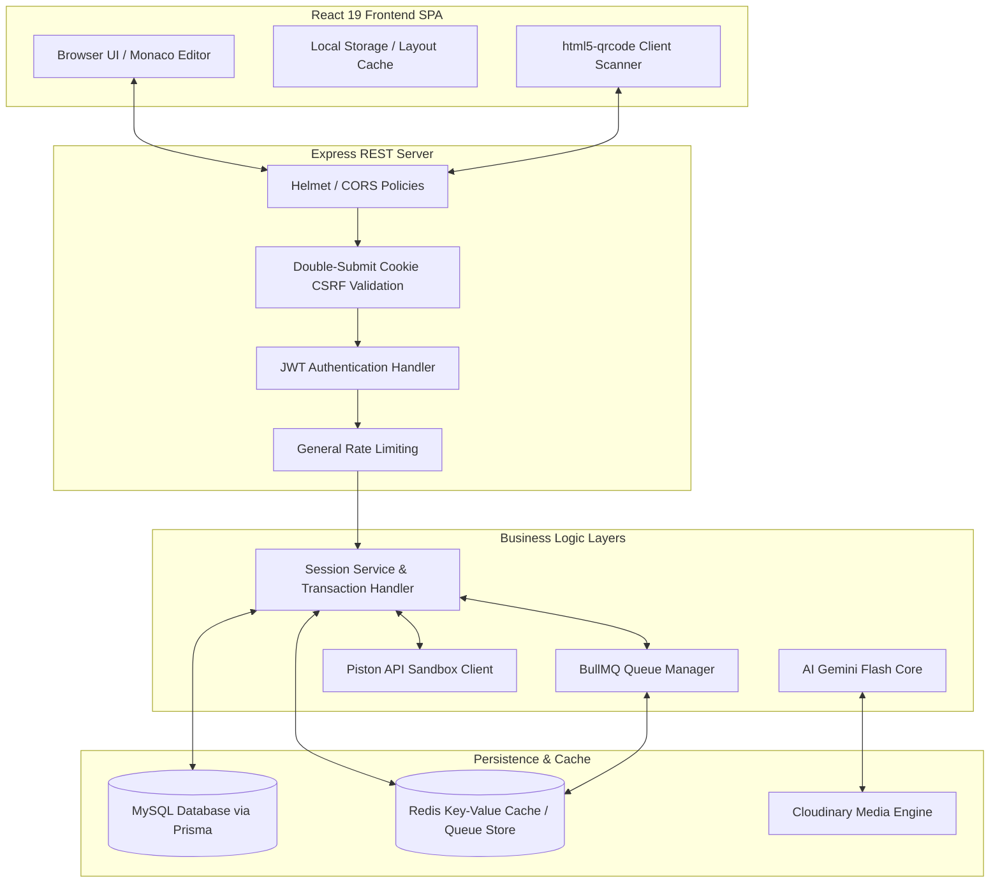

# 🎓 ZenovaX: Peer-to-Peer Learning Platform

> Comprehensive Project Documentation and System Architecture Reference

---

## 📌 Table of Contents
1. [Executive Summary](#-executive-summary)
2. [Project Overview](#-project-overview)
3. [Problem Statement](#-problem-statement)
4. [Solution Provided](#-solution-provided)
5. [Target Audience](#-target-audience)
6. [Key Features and Functionalities](#-key-features-and-functionalities)
7. [User Workflows and User Journey](#-user-workflows-and-user-journey)
8. [Benefits and Value Proposition](#-benefits-and-value-proposition)
9. [Unique Selling Points (USPs)](#-unique-selling-points-usps)
10. [Technical Architecture Insights](#-technical-architecture-insights)
11. [Technology Stack](#-technology-stack)
12. [Integrations and Third-Party Services](#-integrations-and-third-party-services)
13. [Project Structure Insights](#-project-structure-insights)
14. [Screenshots & Recommended Screenshot Locations](#-screenshots--recommended-screenshot-locations)
15. [Installation and Setup Instructions](#-installation-and-setup-instructions)
16. [Usage Guide](#-usage-guide)
17. [Frequently Asked Questions (FAQs)](#-frequently-asked-questions-faqs)
18. [Limitations](#-limitations)
19. [Security and Privacy Considerations](#-security-and-privacy-considerations)
20. [Future Improvements and Roadmap Suggestions](#-future-improvements-and-roadmap-suggestions)
21. [Conclusion](#-conclusion)

---

## 📋 Executive Summary
**ZenovaX** is an advanced, student-to-student peer learning portal designed to make doubts resolution, course practice, and concept clarification rapid, personal, and interactive. Rather than relying on generic prerecorded videos, ZenovaX connects learners directly with peer mentors who lead focused, topic-wise study sessions (available as either free or paid). The system integrates modern web paradigms—including an interactive Monaco-based sandbox coding runner, BullMQ and Redis-backed seat-allocation queues, and a Gemini-powered AI chatbot called "Zen"—to deliver an elite learning ecosystem tailored for the modern student.

---

## 🔍 Project Overview
ZenovaX bridges the gap between academic theory and practical, peer-based collaboration. The system is split into:
* **Frontend**: A highly responsive Single Page Application (SPA) built using React 19, Vite, and TailwindCSS v4, designed exclusively for desktop usage to support advanced compiler layouts.
* **Backend**: An Express.js REST API with database transactions governed by the Prisma ORM connected to MySQL, optimized via distributed Redis cache invalidation and background execution workers.

The platform balances high-performance LMS components with gamification (ratings, points, and achievement badges) to incentivize high-quality peer instruction.

---

## 🎯 Problem Statement
Modern students encounter major challenges when seeking academic support:
1. **Inefficient Doubt Resolution**: Traditional office hours are highly time-constrained. Asking questions during busy university classes is often slow or intimidating.
2. **Exorbitant Tutoring Costs**: Professional 1-on-1 tutoring services are prohibitively expensive for most college students.
3. **Lack of Personalization**: Recorded video platforms (e.g., Udemy, Coursera) lack real-time feedback and are too broad, failing to address specific micro-topics or individual problem hurdles.
4. **No Practical Post-Session Practice**: Typical tutoring sessions do not follow up with structured sandbox execution exercises or immediate feedback loops.

---

## 💡 Solution Provided
ZenovaX provides an integrated ecosystem where students can self-organize and learn from one another:
* **Direct Peer Session Bookings**: Learners register for specific sessions on niche subjects (e.g. "Advanced React Patterns", "Reverse a Linked List") led by student mentors who recently mastered the content.
* **Sandbox Development Playground**: Integrated code editor allows students to compile and run solutions inside the browser side-by-side with example test cases.
* **Ticket & QR Code Attendance Verification**: For offline, local meetups, the platform generates tickets with secure QR codes. Mentors verify entry in real time using their mobile camera.
* **Gamified Achievement Loop**: High ratings and completed sessions unlock badges (Bronze, Silver, Gold, Verified) and points, allowing peer mentors to build a verified portfolio of teaching achievements.

---

## 👥 Target Audience
The system serves three primary user personas:

| Persona | Description | Core Motivation |
| :--- | :--- | :--- |
| **Learner** | College students, interview prep candidates, or self-learners stuck on specific technical blocks. | Quick, affordable doubt-solving and peer-based practical guidance. |
| **Mentor** | High-performing peers, teaching assistants, or junior developers. | Monetizing skills, teaching to learn, and earning verified status badges. |
| **Admin** | Program organizers, platform moderators, or university leads. | Guaranteeing quality control, moderating reports, and auditing session safety. |

---

## 🛠️ Key Features and Functionalities

### 1. Dual-Role Profile Engine
* Users can act as **Learners**, **Mentors**, or **Both** (dual-profile mode).
* Dynamic sidebar navigation changes based on the user's active role.
* Profile completion guard prevents session creation or booking until the bio, LinkedIn, phone, college department, and year of study are validated.

### 2. Double-Booking Safe Reservation Queue
* Concurrent seat reservation uses **BullMQ** job processing and a **Redis distributed lock** (`lock:session:${sessionId}`).
* Eliminates double-booking race conditions during high-volume seat requests.
* Status results are cached for immediate, lightweight client-side polling.

### 3. Smart Code Compiler Sandbox
* **Monaco Editor** integration inside the browser.
* User-controlled resizable layout panels (Problem / Code / Test console) with coordinates stored in `localStorage`.
* Supports keyboard shortcuts (`Cmd/Ctrl + '` to run, `Cmd/Ctrl + Enter` to submit).
* Dual compiler mechanisms:
  * **JavaScript**: Evaluated directly on the client side inside a sandboxed wrapper for latency-free checks.
  * **Python / Java**: Dispatched to the backend service which wraps user code in a dynamic driver class and runs it inside a sandboxed **Piston API** container.
* Automated indentation validation with mixed-space detection (specifically tailored for Python's 4-space rules).

### 4. Interactive Live Classroom & Ticket Engine
* **Virtual Interactive Space**: Integrates mock media controls (microphone/video toggles) and live chat messaging.
* **QR Entry Tickets**: Confirmed offline bookings generate printable entry tickets featuring a unique QR code.
* **Mobile QR Scanner**: Mentors use their mobile device's camera to scan student tickets, immediately updating the database booking status to `attended` and updating learner metrics.

### 5. Help Desk AI Assistant ("Zen")
* Custom conversational agent powered by Google's **Gemini AI** (`gemini-flash-latest`).
* Constrained strictly to the contents of `HELP_CENTER.md` via system prompts to prevent hallucinations about policies or refunds.
* Personalized developer easter egg: If the owner or creator queries "Who built this?", the model replies recognizing the specific user's name as the developer.

### 6. Moderation, Gamification & Badges
* Achievements system automatically monitors metrics to unlock badges (BRONZE, SILVER, GOLD, VERIFIED).
* Review feedback loops require the session to have ended and attendance to be marked as present before allowing a student review.
* Moderation reporting system allows learners to report/flag bad session listings directly to the Admin dashboard.

---

## 🔄 User Workflows and User Journey

### A. The Learner's Journey


### B. The Mentor's Journey


### C. Admin Moderation Workflow


---

## 📈 Benefits and Value Proposition
* **For Learners**: Rapid access to focused human explanations at a fraction of the cost of standard tutoring. Concepts are reinforced immediately through the Monaco playground.
* **For Mentors**: Turn knowledge into passive or active income while building public portfolios, gaining teaching credentials, and verifying engineering competence.
* **For Academic Communities**: Fosters a self-sustaining peer support network that alleviates load on official teaching assistants and course coordinators.

---

## ✨ Unique Selling Points (USPs)
1. **Interactive Reinforcement (No passive learning)**: Integrates Monaco editor sandboxes directly inside the course page. Mentors don't just teach; they launch challenges students solve in real-time.
2. **Robust Double-Booking Avoidance**: Distributed transaction architecture prevents physical classroom overcrowding.
3. **Camera-Integrated Ticket Audits**: Bridging offline campus communities with digital analytics via QR tickets.
4. **Deterministic AI Assistant**: A custom Gemini configuration that acts strictly as a platform support guide, avoiding general knowledge hallucinations.

---

## 🏗️ Technical Architecture Insights

ZenovaX follows a **decoupled Client-Server Architecture** optimized for security, performance, and transactional safety:



### Key Architectural Details:
* **Prisma MySQL Database**: Main database of records, managing relational indices between `User`, `Session`, `Booking`, `Review`, `Quiz`, and `CodingQuestion`.
* **Distributed Lock & Queue (Redis + BullMQ)**: The backend instantiates a shared Redis connection. Seat registration actions are queued inside BullMQ to prevent database bottlenecks. Write locks prevent race conditions on seats.
* **Client-Side JS Sandbox**: To avoid excessive backend resource consumption, JavaScript coding solutions are run locally on the client using a sandboxed `new Function` evaluator.

---

## 💻 Technology Stack

### Frontend Client
* **Framework**: React 19.1 & Vite
* **Routing**: React Router DOM v7
* **Styling**: TailwindCSS v4
* **Icons**: Lucide React
* **Code Editor**: `@monaco-editor/react`
* **QR Processing**: `html5-qrcode` & `react-qr-code`
* **Utilities**: `dom-to-image-more` (ticket image generator), `dompurify` (XSS cleaning), `react-markdown` (AI responses rendering).
* **Monitoring**: `@sentry/react`

### Backend Services
* **Engine**: Node.js & Express
* **Database Access**: Prisma Client v5 (configured with `fullTextIndex` preview flags)
* **Databases**: MySQL (hosted on Aiven)
* **Job Processor**: BullMQ v5
* **Caching**: Redis (hosted on Aiven) & `node-cache` (development fallback)
* **Telemetry**: `@sentry/node` (Sentry)
* **Security & Utility**: `helmet`, `cookie-parser`, `compression`, `xss`, `bcryptjs`, `jose` (JWT).

---

## 🔌 Integrations and Third-Party Services
1. **Google Generative AI SDK**: Integrates `gemini-flash-latest` model to drive the "Zen" interactive help assistant.
2. **Piston API (`emkc.org`)**: Executes Python and Java submissions securely inside lightweight, isolated runner environments.
3. **Cloudinary**: Stores profile pictures and uploaded session PDF/PPT materials.
4. **Nodemailer SMTP**: Handles registration verification codes and password reset tokens.
5. **Sentry**: Captures uncaught application crashes and database connection warnings.

---

## 📁 Project Structure Insights

```
ZenovaX_advance/
├── frontend/
│   ├── src/
│   │   ├── assets/              # Static media assets, mockups, logos
│   │   ├── components/
│   │   │   ├── dashboard/       # Sidebar, Header, and sub-dashboards (learner/mentor)
│   │   │   ├── common/          # QR Generators, preview content wrappers
│   │   │   └── ProtectedRoute   # JWT Auth state gates
│   │   ├── context/             # AuthContext tracking logged-in states
│   │   ├── layouts/             # Learner and Admin navigation grids
│   │   └── pages/
│   │       ├── learner/         # Zen Chatbot, Attempt Coding, SessionDetails
│   │       ├── admin/           # Pending Approval, Moderation, User lists
│   │       └── Home/Auth        # Splash lander, signup/login templates
│   ├── vite.config.js
│   └── tailwind.config.js
├── backend/
│   ├── config/                  # Server configuration keys and path definitions
│   ├── controllers/             # Request handlers (auth, sessions, reports, quiz)
│   ├── middleware/              # Rate limiters, CSRF double-submit checks, auth gates
│   ├── prisma/                  # schema.prisma definition and migration tables
│   ├── routes/                  # Express route bindings (auth, coding, social, etc.)
│   ├── services/                # Heavy business logic (Prisma queries, execution logic)
│   ├── utils/                   # BullMQ helper, ioredis caches, Winston loggers
│   └── server.js                # Server entry point
├── HELP_CENTER.md               # Strict context source for the Zen AI assistant
└── vercel.json                  # Serverless deployment parameters
```

---

## 📸 Screenshots & Recommended Screenshot Locations
To compile a highly polished visual pitch deck or documentation portal, capture screenshots at the following key locations:

1. **Dashboard Home Page (`/dashboard`)**:
   * *Location*: Renders `DashboardView.jsx`.
   * *Visual elements to highlight*: Search bar, quick stats card, horizontal upcoming session cards, and recommended peer mentors.
2. **Interactive Monaco Playground (`/coding/:id/attempt`)**:
   * *Location*: Renders `AttemptCodingQuestion.jsx`.
   * *Visual elements to highlight*: Monaco editor showing syntax highlighting, resizable panel dividers, compilation logs on the right, and the test results checklist.
3. **Zen AI Assistant (`/zen`)**:
   * *Location*: Renders `Zen.jsx` view.
   * *Visual elements to highlight*: The animated glowing orb canvas element, AI markdown text blocks, and the search input bar.
4. **QR Code Ticket Modal (`/bookings` -> View Ticket)**:
   * *Location*: Renders modal inside `MyBookingsView.jsx`.
   * *Visual elements to highlight*: Clean barcode presentation, session details, and download button.
5. **Ticket Scanner Portal (`/mentor-dashboard` -> Scan Attendance)**:
   * *Location*: Renders `QRScanner.jsx` viewport.
   * *Visual elements to highlight*: Active video camera canvas scanning the code, highlighting instant attendance check indicators.

---

## ⚙️ Installation and Setup Instructions

### Prerequisites
* Node.js (v18+)
* MySQL Instance (or a PostgreSQL instance with schema adjustments)
* Redis Server (optional in development; defaults to NodeCache fallback)
* Gemini API Key

### A. Backend Setup
1. Navigate to the backend directory:
   ```bash
   cd backend
   ```
2. Install dependencies:
   ```bash
   npm install
   ```
3. Create a `.env` file based on `.env.example` and fill in local values:
   ```bash
   cp .env.example .env
   ```
4. Perform database migrations and generate the Prisma Client:
   ```bash
   npx prisma migrate dev
   npx prisma generate
   ```
5. Run the server in development mode:
   ```bash
   npm run dev
   ```

### B. Frontend Setup
1. Navigate to the frontend directory:
   ```bash
   cd ../frontend
   ```
2. Install dependencies:
   ```bash
   npm install
   ```
3. Create your `.env` file (pointing to the backend REST URL):
   ```bash
   cp .env.example .env
   ```
4. Start the Vite development server:
   ```bash
   npm run dev
   ```
5. Open your browser to `http://localhost:5173`.

---

## 📖 Usage Guide

### For Learners
1. **Explore & Filter**: Look for scheduled sessions on your dashboard or navigate to **Browse Sessions** to filter by topic, level, or price.
2. **Registration**: Reserve your seat (this triggers the BullMQ transaction).
3. **Session Resources**: Once registered, go to the session details. Check the **Resources** tab to download lecture slides/slides.
4. **Quizzes & Coding**: Practice with interactive questions during or after sessions. If you choose JavaScript, your code runs instantly inside your browser.
5. **Entry Ticket**: For local meetups, access your dashboard booking, click **View Ticket**, download the PNG, and display the QR code at the venue.

### For Peer Mentors
1. **Propose Sessions**: Go to your dashboard and select **Create Session**. Define whether it is online/offline, maximum seats, and upload course resources.
2. **Wait for Audit**: The session request goes to the Admin pending log.
3. **Prepare Tasks**: Add coding questions (with test case definitions) or quizzes.
4. **Mark Attendance**: Click **Scan Attendance** to verify student QR entries.

---

## ❓ Frequently Asked Questions (FAQs)

#### Q: How does the compiler handle Python or Java scripts safely?
User code is forwarded to the Piston API, which executes it inside isolated, short-lived containers. The code is wrapped dynamically on the server side with helper classes to capture stdout and trace exceptions, keeping the execution secure.

#### Q: Can learners book multiple slots for the same session?
No, the database schema enforces a unique index constraint: `@@unique([userId, sessionId])` on the `bookings` table to prevent duplicate seat claims.

#### Q: Can I run this system without Redis in development?
Yes. The custom cache engine detects the missing `REDIS_URL` and falls back automatically to an in-memory `node-cache` cache store, while BullMQ execution falls back to synchronous transactions.

---

## ⚠️ Limitations
1. **No Embedded Video Streams**: Live online sessions rely on external links (Zoom, Google Meet) rather than native WebRTC streams.
2. **No Interactive Collaborative Boards**: Live classroom views currently display visual status controls and chat rooms, but lack real-time digital whiteboards.
3. **Manual Refund Approvals**: Financial refunds are reviewed manually; there is no automated gateway rollback.
4. **No Automated Code Grading Weightage**: Code submissions verify if test cases pass, but they do not automatically calculate grading scores or award certificates.

---

## 🔒 Security and Privacy Considerations
* **CSRF Mitigation**: Double Submit Cookie protection verifies mutated operations (POST/PUT/DELETE) by validating that the client's `X-CSRF-Token` header matches the browser's `csrfToken` cookie.
* **Content Security Policy (CSP)**: Powered by Helmet. Ensures that scripts, media resources, and stylesheets are loaded only from approved domain names.
* **SQL Injection & XSS Protection**: Controlled via Prisma's automated parameter escaping. Request data sizes are limited to 50KB to prevent Denial of Service (DoS) exploits, and content is cleaned with XSS sanitizers.
* **CORS Whitelist**: Whitelist configurations prevent domain hijacking attacks and restrict access to authorized origins.

---

## 🚀 Future Improvements and Roadmap Suggestions
* [ ] **Zoom / Jitsi SDK Integration**: Embed video calls directly into the live classroom page (`LiveSession.jsx`) to keep learners on-site.
* [ ] **Collaborative Live Code Editing**: Integrate Operational Transformation (OT) or Yjs into Monaco Editor to allow mentors and students to edit code simultaneously.
* [ ] **Stripe & PhonePe Direct Gateway Rollback**: Automated payment refunds if a mentor cancels an approved session.
* [ ] **Code Submission Insights**: Save compilation runtime metrics, memory footprint logs, and show comparison charts relative to other student submissions.
* [ ] **Custom Coding Contests**: Allow admins and gold-tier mentors to coordinate department-wide hackathons on the platform.

---

## 🏁 Conclusion
ZenovaX is a modern, feature-rich peer-to-peer education ecosystem. By combining database transactional safety, modular layout playgrounds, and secure ticket-scanning entry systems, it provides a comprehensive learning environment. It serves as a strong foundation for any community-oriented education platform.