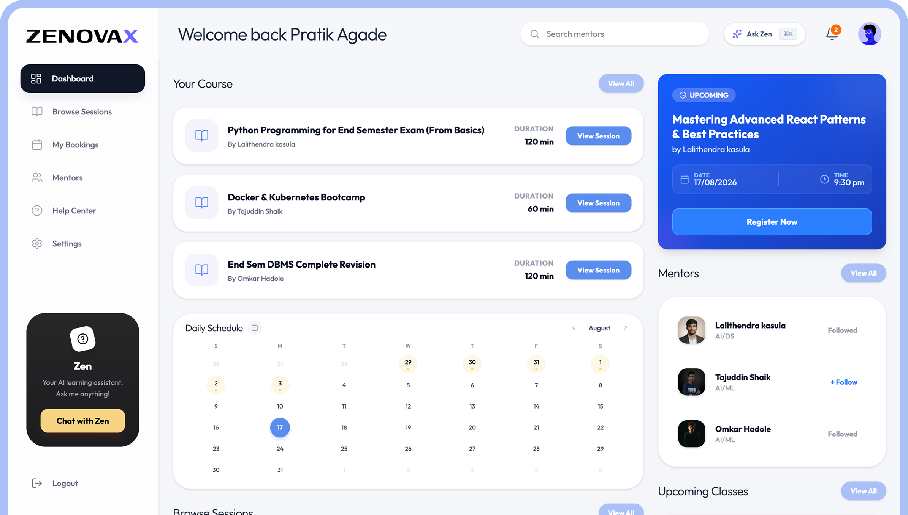

# 🎓 **ZenovaX**
A Peer-to-Peer Learning Platform for Students  
Learn faster through peer sessions, notes, quizzes, and mentor ratings.

  

---

## 📌 1. **Overview**

**ZenovaX** is a peer-to-peer learning platform where students can book topic-based sessions (free or paid), learn from verified student mentors, receive notes & quizzes, and rate mentors to maintain learning quality.

🎯 **Why ZenovaX?**
- Doubts solved faster than faculty timings
- Learning from relatable students
- Affordable or free student mentors
- Structured post-session resources

---

## 🎯 2. **Problem Statement**

Students face:

- Slow doubt resolution in class
- Expensive coaching & tutoring
- No personalized, topic-level help
- No structured post-learning practice
- Lack of peer-based collaboration

💡 **Solution → ZenovaX**

Students can:
- Book free/paid peer learning sessions
- Learn topic-wise with practical problem solving
- Get quizzes + notes after sessions
- Rate mentors to improve quality

---

## 🏗️ 3. **System Architecture**

### 📌 Architecture Flow

### 🛠 Tech Stack

| Layer | Technology |
|-------|------------|
| Frontend | React.js, TailwindCSS |
| Backend | Node.js, Express.js |
| Database | Prisma |
| Authentication | JWT |
| Hosting | Vercel + Aiven |

### 🌍 Hosting Overview

| Component | Platform |
|----------|----------|
| Frontend | Vercel |
| Backend | Vercel |
| Database | Aiven |

---

## ⭐ 4. **Key Features**

✔ **Peer Sessions**
- Free & paid options
- Offline + online support
- Limited seats (not a webinar)

✔ **Mentor Reviews**
- Student mentors rated by learners
- Helps choose the best mentor

✔ **Resources + Quizzes**
- Notes shared after sessions
- Topic-based quizzes included

✔ **CRUD Operations**
- Sessions, Mentors, Resources, Reviews

✔ **Pagination & Filtering**
- Filter by topic, mentor, price
- Paginated session listing

---

## 🔌 5. **API Overview**

### 🧑‍🏫 Session APIs
| Method | Endpoint | Description |
|--------|----------|-------------|
| POST | `/api/mentor/create-session` | Create a session |
| GET | `/api/sessions` | List all sessions |
| GET | `/api/sessions/:id` | Session details |
| PUT | `/api/mentor/edit-session/:id` | Update session |
| DELETE | `/api/admin/pending-sessions` | Cancel session |

### 📚 Resources + Quiz APIs
| Method | Endpoint | Description |
|--------|----------|-------------|
| POST | `/api/mentor/upload-resource` | Upload resource |
| GET | `/api/sessions/:sessionId` | Fetch resources |
| PUT | `/api/resources/:id` | Update resource |
| DELETE | `/api/resources/:id` | Delete resource |

### ⭐ Reviews APIs
| Method | Endpoint | Description |
|--------|----------|-------------|
| POST | `/api/reviews` | Add review |
| GET | `/api/reviews/:mentorId` | Get reviews |
| PUT | `/api/reviews/:id` | Edit review |
| DELETE | `/api/reviews/:id` | Delete review |

---

## 🛠️ 6. **Tech Stack Summary**

| Layer | Technologies |
|-------|--------------|
| Frontend | React.js + TailwindCSS |
| Backend | Node.js + Express |
| Database | Prisma|
| Authentication | JWT |
| Deployment | Vercel + Aiven |

---

## 📄 License
This project is for educational and community use. It may be extended commercially with further development.

---

## 🤝 Contributions
Got ideas to enhance peer learning?  
Feel free to open issues or submit PRs to improve **ZenovaX**.

---
# ZenovaX-main
