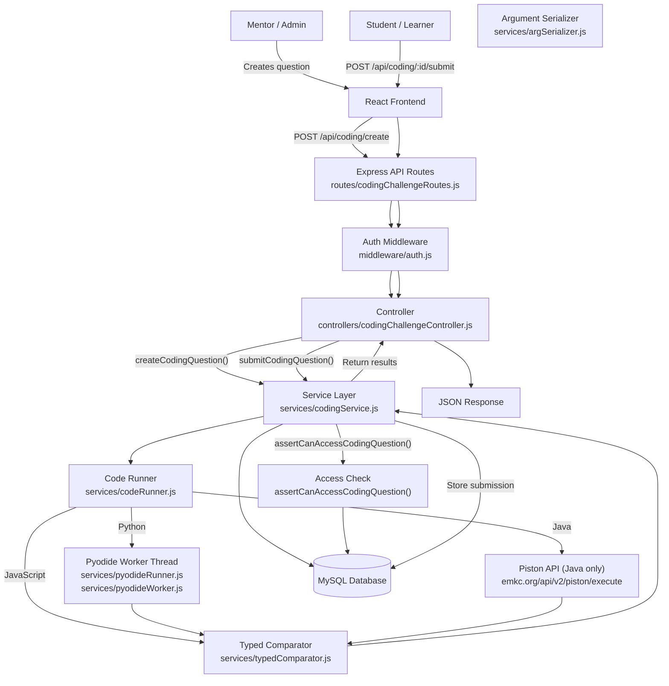
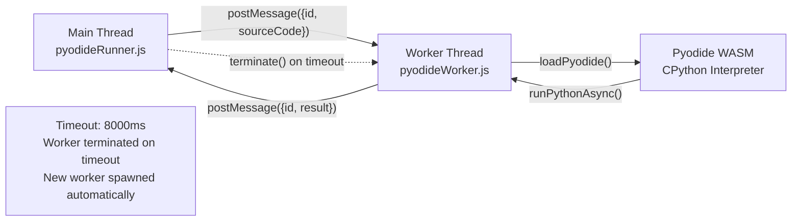

# ZenovaX — Coding Submissions Deep Technical Audit

> **Audit Date:** July 28, 2026
> **Scope:** Full lifecycle of coding question creation, code execution, submission, storage, and scoring
> **Files Analyzed:** 14 source files across routes, controllers, services, utilities, and schema

---

## Table of Contents

1. [High-Level Architecture](#1-high-level-architecture)
2. [Database Analysis](#2-database-analysis)
3. [Complete Request Flow](#3-complete-request-flow)
4. [Code Execution Flow](#4-code-execution-flow)
5. [Test Case System](#5-test-case-system)
6. [Database Storage Audit](#6-database-storage-audit)
7. [Query Analysis](#7-query-analysis)
8. [Performance Audit](#8-performance-audit)
9. [Security Audit](#9-security-audit)
10. [Scalability](#10-scalability)
11. [Storage Optimization Ideas](#11-storage-optimization-ideas)
12. [Production Readiness](#12-production-readiness)
13. [Future Improvements](#13-future-improvements)
14. [Final Verdict](#14-final-verdict)

---

## 1. High-Level Architecture

### Lifecycle of a Coding Submission



### File Responsibilities

| Step | File(s) | Function |
|---|---|---|
| Route definition | `routes/codingChallengeRoutes.js` | Maps HTTP verbs + paths to controllers |
| Route definition (execute) | `routes/codingChallengeRoutes.js:9` | Maps `POST /execute` to execution controller |
| Authentication | `middleware/auth.js:5-47` | JWT verification, session revocation check |
| Profile completion check | `middleware/auth.js:79-98` | Ensures user has completed profile |
| Controller | `controllers/codingChallengeController.js` | Delegates to service, formats response |
| Controller (execute) | `controllers/codingExecutionController.js` | Delegates to executeCode |
| Business logic | `services/codingService.js` | Question CRUD, submission flow, access control |
| Code execution | `services/codeRunner.js` | Test case execution for JS/Python/Java |
| Python runtime | `services/pyodideRunner.js` | Manages Pyodide worker thread lifecycle |
| Python worker | `services/pyodideWorker.js` | Runs CPython via WebAssembly in worker thread |
| Structured question engine | `services/questionTypeEngine.js` | Signature validation, type system |
| Typed comparison | `services/typedComparator.js` | Type-aware output comparison |
| Argument serialization | `services/argSerializer.js` | Serializes args to language-specific syntax |
| Starter code generation | `services/starterCodeGenerator.js` | Generates starter code per language |
| Database schema | `prisma/schema.prisma:811-875` | CodingQuestion + CodingSubmission models |

---

## 2. Database Analysis

### 2.1 CodingQuestion Model

**Schema:** `backend/prisma/schema.prisma:811-852`

**Estimated average row size:** ~2 KB  
**Estimated maximum row size:** ~10 KB (when `description`, `testCases`, `starterCode`, `referenceSolution`, and `structuredTestCases` are all populated)

| Column | Type | Attributes | Storage Cost | Why It Exists |
|---|---|---|---|---|
| `id` | `String` | `@id @default(uuid())` | 36 B | Primary key |
| `creatorId` | `String` | FK to User | 36 B | Who created the question |
| `sessionId` | `String` | FK to Session | 36 B | Which session the question belongs to |
| `title` | `String` | Required | ~50-200 B | Question title/name |
| `description` | `String` | `@db.Text` | ~500 B - 5 KB | Problem statement (markdown) |
| `testCases` | `String` | `@db.Text` | ~500 B - 3 KB | JSON array of legacy test cases `[{input, output, isHidden}]` |
| `difficulty` | `String` | `@default("MEDIUM")` | ~10 B | EASY / MEDIUM / HARD |
| `allowedLanguages` | `String?` | `@db.Text` | ~50-200 B | JSON array like `["javascript","python"]` |
| `starterCode` | `String?` | `@db.Text` | ~500 B - 2 KB | JSON map of starter code per language |
| `referenceSolution` | `String?` | `@db.Text` | ~500 B - 3 KB | Reference solution code |
| `timeLimitMinutes` | `Int?` | Nullable | 4 B | Time limit for the question |
| `points` | `Int?` | `@default(100)` | 4 B | Points awarded |
| `questionType` | `String?` | `@default("legacy")` | ~10 B | `"legacy"` or `"structured"` |
| `functionName` | `String?` | Nullable | ~20-100 B | e.g. `"twoSum"` (structured questions) |
| `parameters` | `String?` | `@db.Text` | ~200 B - 1 KB | JSON: `[{name, type}]` (structured) |
| `returnType` | `String?` | Nullable | ~20 B | e.g. `"integer[]"` (structured) |
| `structuredTestCases` | `String?` | `@db.Text` | ~500 B - 3 KB | JSON: `[{inputs, expected, isHidden}]` |
| `status` | `QuizStatus` | `@default(DRAFT)` | ~10 B | DRAFT / LIVE / CLOSED |
| `createdAt` | `DateTime` | `@default(now())` | 8 B | Creation timestamp |
| `updatedAt` | `DateTime` | `@updatedAt` | 8 B | Last update timestamp |

**Relations:**
- `creator` → `User` (required, cascade delete)
- `session` → `Session` (required, cascade delete)
- `submissions` → `CodingSubmission[]` (one-to-many)

**Indexes:**
- `@@index([creatorId])` — FK lookup
- `@@index([sessionId])` — FK lookup

**Missing indexes:**
- No index on `status` — filtering by LIVE/DRAFT/CLOSED does a table scan
- No composite index on `(sessionId, status)` — the most common query pattern (`getCodingQuestionsBySession` filters by sessionId, sorts by createdAt)

### 2.2 CodingSubmission Model

**Schema:** `backend/prisma/schema.prisma:854-875`

**Estimated average row size:** ~500 B  
**Estimated maximum row size:** ~10 KB+ (when `code` contains a large solution)

| Column | Type | Attributes | Storage Cost | Why It Exists |
|---|---|---|---|---|
| `id` | `String` | `@id @default(uuid())` | 36 B | Primary key |
| `userId` | `String` | FK to User | 36 B | Who submitted |
| `codingQuestionId` | `String` | FK to CodingQuestion | 36 B | Which question was answered |
| `code` | `String` | `@db.Text` | ~200 B - 10 KB | **The submitted code — largest column** |
| `language` | `String` | Required | ~10 B | `javascript`, `python`, or `java` |
| `status` | `String` | Required | ~10 B | `PASSED` or `FAILED` |
| `createdAt` | `DateTime` | `@default(now())` | 8 B | Submission timestamp |

**Relations:**
- `user` → `User` (required, cascade delete)
- `codingQuestion` → `CodingQuestion` (required, cascade delete)

**Indexes:**
- `@@index([userId])` — FK lookup
- `@@index([codingQuestionId])` — FK lookup
- `@@index([userId, codingQuestionId])` — composite for "has user solved this?" queries

**Key observations:**
- `code` is stored **uncompressed as `@db.Text`** in MySQL. This is the single largest storage consumer in the entire project.
- There is no `storageKey` / external reference column — code is always stored inline.
- There is no `testResults` column — results are computed on the fly and returned in the response but **not persisted**.
- There is no `score` or `points` column — the system tracks only pass/fail status.

### 2.3 Storage Comparison: CodingQuestion vs CodingSubmission

| Metric | CodingQuestion | CodingSubmission |
|---|---|---|
| Rows per 100 users | ~5 (created by mentors) | ~200 (submitted by learners) |
| Average row size | ~2 KB | ~500 B (code-dependent) |
| Growth rate | O(mentors) | **O(learners x submissions)** |
| Primary storage driver | `testCases` JSON | `code` Text column |
| Index overhead | Low (2 indexes) | Moderate (3 indexes, one composite) |

---

## 3. Complete Request Flow

### 3.1 Route: `POST /api/coding/execute`

**Purpose:** Run code against test cases without storing a submission (preview/run mode).

```
Request
  → routes/codingChallengeRoutes.js:9
    → controllers/codingExecutionController.js:3
      → services/codingService.js:464 (executeCode)
        → assertCanAccessCodingQuestion() [services/codingService.js:85]
          → prisma.codingQuestion.findUnique() — check question exists + session info
          → prisma.booking.findFirst() — check user is booked (if not creator/admin)
        → codeRunner.runTestCases() [services/codeRunner.js:217]
          OR codeRunner.runStructuredTestCases() [services/codeRunner.js:279]
        → Response with results + logs
```

### 3.2 Route: `POST /api/coding/:id/submit`

**Purpose:** Submit a solution, run all test cases, store the submission and result.

```
Request
  → routes/codingChallengeRoutes.js:17
    → controllers/codingChallengeController.js:57 (submitCodingQuestion)
      → services/codingService.js:347 (submitCodingQuestion)
        → assertCanAccessCodingQuestion() [line 85]
          → prisma.codingQuestion.findUnique({ include: { session: true } })
          → prisma.booking.findFirst() [if non-privileged]
        → parseTestCases(question.testCases) or question.structuredTestCases
        → codeRunner.runTestCases() or codeRunner.runStructuredTestCases()
          → validateRunInput() [codeRunner.js:195]
          → Language dispatch:
            JavaScript → runJavaScriptTestCases() [codeRunner.js:131]
            Python → pyodideRunner.executePython() [pyodideRunner.js:70]
            Java → executePiston() [codeRunner.js:95]
          → Per-test-case comparison → { passed: true/false }
        → prisma.codingSubmission.create() — store submission
        → Response with submission + results + error
```

### 3.3 Route: `GET /api/coding/:id`

**Purpose:** View a single coding question (including test cases).

```
Request
  → routes/codingChallengeRoutes.js:16
    → controllers/codingChallengeController.js:75 (getCodingQuestionById)
      → services/codingService.js:428 (getCodingQuestionById)
        → assertCanAccessCodingQuestion() [line 85]
        → prisma.codingSubmission.findMany() — check if user has passed
        → Parse + redact hidden test cases
        → Response with question + visible test cases
```

### 3.4 Route: `GET /api/coding/session/:sessionId`

**Purpose:** List all coding questions for a session.

```
Request
  → routes/codingChallengeRoutes.js:14
    → controllers/codingChallengeController.js:21 (getCodingQuestionsBySession)
      → services/codingService.js:327 (getCodingQuestionsBySession)
        → prisma.codingQuestion.findMany({ where: { sessionId }, include: { submissions: { where: { userId, status: 'PASSED' } } } })
        → Response with questions + isSolved flag
```

### 3.5 Middleware Applied

All coding routes pass through:

1. `protect` (`middleware/auth.js:5`) — JWT verification, session revocation check
2. `requireProfileComplete` (`middleware/auth.js:79`) — Ensures user profile is complete

For mentor-only actions (create, launch, close, update), `authorize('MENTOR', 'BOTH')` is also applied.

### 3.6 Authentication Flow Detail

```
auth.js:5-47
  → Reads token from cookie (req.cookies.token) or Authorization header (Bearer)
  → jwtVerify(token, secret) — verifies HS256 JWT, extracts { userId, role }
  → Optional: checks refreshToken cookie for revocation status
    → prisma.refreshToken.findUnique({ where: { token: hash(refreshToken) } })
    → If revoked → clears cookies, returns 401
  → Sets req.user = { id: payload.userId, role: payload.role }
```

---

## 4. Code Execution Flow

### 4.1 Supported Languages

Three languages are supported (`codingService.js:119`):

```
ALLOWED_LANGUAGES = ['javascript', 'python', 'java'];
```

### 4.2 Language Dispatch

Each language uses a different execution strategy (`codeRunner.js:223-250`):

```
Language   Execution Method                   Sandbox                Timeout
─────────  ─────────────────────────────────  ─────────────────────  ────────
JavaScript Node.js vm.runInContext()          vm.createContext()     3000 ms
Python     Pyodide (WebAssembly CPython)      worker_thread + WASM   8000 ms
Java       Remote Piston API (HTTP)           External (Piston)      10000 ms
```

### 4.3 JavaScript Execution

**File:** `services/codeRunner.js:131-159`

```javascript
const runJavaScriptTestCases = (userCode, testCases) => {
    const sandbox = { console: { log: captureLog, error: captureLog, warn: captureLog } };
    const context = vm.createContext(sandbox);

    vm.runInContext(userCode, context, { timeout: JS_TIMEOUT_MS, displayErrors: true });
    // ... calls solve(input) per test case via vm.runInContext
};
```

**How it works:**
1. Creates a sandbox object with a captured `console`
2. Creates a V8 context via `vm.createContext(sandbox)`
3. Executes the user's code in that context with a **3000 ms hard timeout**
4. For each test case, calls `solve(input)` via `vm.runInContext`
5. Returns outputs array + captured log output

**Protections:**
- `vm.createContext()` isolates the global scope
- `JS_TIMEOUT_MS = 3000` prevents infinite loops from hanging the event loop

**Limitations:**
- `vm` is **not a security sandbox** (as documented in the comment at line 125-130). A malicious user can escape via prototype pollution, `constructor.constructor('return this')()`, or `require` (if the global `require` is accessible).
- `console` is heavily restricted but `setTimeout`, `fetch`, `Promise`, and other Node.js globals may leak through prototype chains.

### 4.4 Python Execution

**Files:**
- `services/pyodideRunner.js` — Worker lifecycle management
- `services/pyodideWorker.js` — Pyodide runtime inside worker thread

**Architecture:**



**How it works (`pyodideRunner.js:70-85`):**

1. `executePython(sourceCode)` creates a Promise and sends `{id, sourceCode}` to the worker
2. A timeout is set for `PYTHON_TIMEOUT_MS = 8000 ms`
3. If the worker responds in time → resolve with `{stdout, stderr}`
4. If timeout fires → **terminate the worker**, set `worker = null`, and resolve with a timeout error

**How the worker works (`pyodideWorker.js:39-66`):**

1. Receives `{id, sourceCode}` from parent
2. Lazily loads Pyodide via `loadPyodide()` (only once — ~14 MB WASM runtime, takes 1-3 seconds)
3. Creates a fresh Python namespace (bare dict)
4. Sets `__name__ = '__main__'` so the driver code's `if __name__ == "__main__":` guard evaluates true
5. Runs `pyodide.runPythonAsync(sourceCode)` — this is **asynchronous from JS but synchronous from Python's perspective**
6. Captures stdout (via `sys.stdout.getvalue()`) and stderr (try/catch)
7. Sends result back to parent

**The driver code** (`codeRunner.js:14-51` for legacy, `argSerializer.js:73-104` for structured):

```python
import sys, io
{userCode}
def driver():
    inputs = [...]  # serialized test case inputs
    results = []
    for i in inputs:
        try:
            res = solve(i)        # user's function
            results.append(str(res))
        except Exception as e:
            results.append(f"Error: {str(e)}")
    print("===LOGS_DONE===")
    print("|||".join(results))

if __name__ == "__main__":
    driver()
```

**Protections:**
- Runs in a separate worker_thread — infinite loops block only the worker, not the main server
- 8000 ms hard timeout → worker is terminated
- Pyodide itself is sandboxed by WebAssembly (no native system calls, no filesystem, no network)

**Limitations:**
- Only one worker is shared across all requests (`pyodideRunner.js:61-63`). If a long-running Python execution blocks the worker, **all subsequent Python submissions queue behind it**.
- Worker memory is not explicitly capped (Python can allocate WASM memory up to Node.js heap limit).
- `import os`, `import subprocess` may work inside Pyodide depending on the build — no explicit import restrictions are applied.

### 4.5 Java Execution

**File:** `services/codeRunner.js:95-123`

```javascript
const executePiston = async (language, sourceCode) => {
    const resp = await axios.post(
        process.env.PISTON_API_URL || 'https://emkc.org/api/v2/piston/execute',
        {
            language: language.toLowerCase(),
            version: '*',
            files: [{ name: 'solution', content: sourceCode }],
            stdin: '',
        },
        { timeout: 10000 }
    );
};
```

**How it works:**
1. Sends the driver code (containing user code) to Piston API
2. Piston compiles and executes Java remotely
3. Returns stdout/stderr/exit code

**The driver code** (`codeRunner.js:54-93` for legacy, `argSerializer.js:107-144` for structured):

```java
import java.util.*;
import java.io.*;

public class Main {
    public static void main(String[] args) {
        String[] inputs = { /* test cases */ };
        List<String> results = new ArrayList<>();
        Solution s = new Solution();
        for (String input : inputs) {
            try {
                String res = s.solve(input);
                results.add(res);
            } catch (Exception e) {
                results.add("Error: " + e.getMessage());
            }
        }
        System.out.println("===LOGS_DONE===");
        System.out.print(String.join("|||", results));
    }
}
{userCode}
```

**Protections:**
- External API — user code never runs on the ZenovaX server
- 10-second HTTP timeout prevents slow executions from blocking
- Piston has its own sandboxing (seccomp, time limits, memory limits)

**Risks:**
- **External dependency** — if Piston API goes down or rate-limits you, Java execution breaks
- No fallback if Piston is unavailable (throws `AppError('Code execution service unavailable', 503)`)
- Network latency adds 100-500 ms per execution
- Piston's free tier may have rate limits (not documented in code)

### 4.6 Structured vs Legacy Questions

The system has two question modes (`codingService.js:357`):

| Feature | Legacy | Structured |
|---|---|---|
| `questionType` | `"legacy"` | `"structured"` |
| Test cases | `testCases` = `[{input: "string", output: "string", isHidden}]` | `structuredTestCases` = `[{inputs: {paramName: value}, expected: value, isHidden}]` |
| Function signature | `solve(input)` — single string param | Custom function name + typed params |
| Execution driver | `getDriverCode()` in `codeRunner.js` | `buildStructuredDriverCode()` in `argSerializer.js` |
| Comparison | Simple string `.trim()` comparison | `typedCompare()` with type awareness |
| Starter code | None generated | `starterCodeGenerator.js` generates per-language |

---

## 5. Test Case System

### 5.1 Test Case Storage

Test cases are stored as JSON strings inside `@db.Text` columns:

**Legacy format** (`coding_questions.testCases`):
```json
[
    {"input": "5", "output": "25", "isHidden": false},
    {"input": "0", "output": "0", "isHidden": false},
    {"input": "-3", "output": "9", "isHidden": true}
]
```

**Structured format** (`coding_questions.structuredTestCases`):
```json
[
    {"inputs": {"nums": [2, 7, 11, 15], "target": 9}, "expected": [0, 1], "isHidden": false},
    {"inputs": {"nums": [3, 3], "target": 6}, "expected": [0, 1], "isHidden": true}
]
```

### 5.2 Visible vs Hidden Test Cases

Determined by `isTestCaseHidden()` in `codingService.js:13-14`:

```javascript
const isTestCaseHidden = (tc, index) =>
    tc && typeof tc.isHidden === 'boolean' ? tc.isHidden : index >= 2;
```

- If `isHidden` is explicitly set, use that
- **Fallback**: test cases at index 0 and 1 are visible; index 2+ are hidden (backward compatibility with old data)

**Redaction logic** ensures non-privileged users never see hidden inputs:

- `redactHiddenTestCases()` (`codingService.js:16`) — replaces hidden case input/output with `'Hidden'`
- `redactHiddenResults()` (`codingService.js:27`) — replaces actual output with `'Hidden'` or `'Wrong Answer'`
- Only the question creator and ADMIN users see the full unredacted data

### 5.3 Comparison / Pass-Fail Logic

**Legacy questions** (`codeRunner.js:252-260`):

```javascript
const results = testCases.map((tc, index) => {
    const actual = rawOutputs[index] !== undefined ? rawOutputs[index].replace(/\n/g, '') : 'No Output';
    return {
        input: tc.input,
        expected: tc.output,
        actual,
        passed: actual.trim() === String(tc.output).trim()
    };
});
```

**Pass condition:** `actual.trim() === String(tc.output).trim()`  
**This is a simple string equality check.** No type coercion, no whitespace normalization beyond trimming.

**Structured questions** (`typedComparator.js:15-59`):

Uses `typedCompare(expected, actual, returnType)` with type-specific logic:

| `returnType` | Comparison | Tolerance |
|---|---|---|
| `integer` | `Number(expected) === Number(actual)` | Exact |
| `float` | `Math.abs(ef - af) <= 1e-6` | Epsilon = 0.000001 |
| `string` | `String(expected) === String(actual)` | Exact |
| `boolean` | `Boolean(expected) === Boolean(actual)` | Coercive |
| `X[]` (arrays) | Recursive `typedCompare` per element | Element-type dependent |
| `X[][]` (nested arrays) | Recursive `deepEqual` | Element-type dependent |

### 5.4 Scoring

There is **no scoring system** for individual submissions. The status is binary:
- `PASSED` — all test cases pass (`results.every(r => r.passed)`)
- `FAILED` — any test case fails, or there's a runtime error

The `points` field on `CodingQuestion` (default: 100) exists in the schema but is **never read or used** in any submission logic.

### 5.5 Submission Storage After Execution

**File:** `services/codingService.js:380-411`

```javascript
submission = await prisma.codingSubmission.create({
    data: {
        userId,
        codingQuestionId: id,
        code: storageKey ? `${LOCAL_STORAGE_KEY_PREFIX}${storageKey}` : code,
        language,
        status
    }
});
```

- The entire `code` is stored as-is in the database (unless a `storageKey` is provided, which prepends `lk:`)
- `status` is `'PASSED'` or `'FAILED'`
- **Test case results are NOT stored** — they are returned in the response but never persisted

---

## 6. Database Storage Audit

### 6.1 Per-Submission Storage Breakdown

| Column | Type | Typical Size | Worst Case |
|---|---|---|---|
| `id` (UUID) | `varchar(36)` | 36 B | 36 B |
| `userId` (UUID) | `varchar(36)` | 36 B | 36 B |
| `codingQuestionId` (UUID) | `varchar(36)` | 36 B | 36 B |
| `code` | `text` | **200 B - 2 KB** | **10 KB+** |
| `language` | `varchar(~10)` | 10 B | 10 B |
| `status` | `varchar(6)` | 6-8 B | 8 B |
| `createdAt` | `datetime` | 8 B | 8 B |
| **Indexes** (3 indexes) | overhead | ~150 B | ~300 B |
| **Total** | | **~500 B** | **~10.5 KB** |

### 6.2 Storage Projections

| Submissions | Code storage | Total table size |
|---|---|---|
| **100** | ~40 KB (avg 400 B/code) | ~65 KB |
| **1,000** | ~400 KB | ~625 KB |
| **10,000** | ~4 MB | ~6.25 MB |
| **100,000** | ~40 MB | ~62.5 MB |

| User scale | Monthly submissions | Monthly storage | Annual storage |
|---|---|---|---|
| 500 users | 1,000 (2/user/mo) | ~625 KB | ~7.5 MB |
| 2,000 users | 4,000 | ~2.5 MB | ~30 MB |
| 10,000 users | 20,000 | ~12.5 MB | ~150 MB |
| 25,000 users | 50,000 | ~31 MB | ~375 MB |

### 6.3 What Consumes the Most Storage

1. **`code` column (85-90%)** — The submitted source code is the dominant consumer. Even a simple 10-line Python solution is ~200 B. Complex solutions with multiple helper functions can reach 5-10 KB.
2. **Indexes (5-8%)** — Three indexes, one of which is composite `(userId, codingQuestionId)`.
3. **UUID primary key + FK overhead (5-7%)** — Each submission stores 3 UUIDs (id, userId, codingQuestionId).

### 6.4 What Is NOT Stored (Notable Absences)

- Test case results are **not persisted** — they are computed on every request and returned in the response only
- No `execution_time_ms`, `memory_used_bytes`, or any execution metadata
- No `attempt_number` — if a user submits the same question 10 times, there are 10 rows with no sequence field
- No `score` or `points_awarded` — the `points` column on `CodingQuestion` is defined but never used

---

## 7. Query Analysis

### 7.1 All Queries Mapped

#### Query 1: `assertCanAccessCodingQuestion` — Question lookup

**File:** `services/codingService.js:86-89`

```javascript
const question = await prisma.codingQuestion.findUnique({
    where: { id },
    include: { session: { select: { id: true, title: true, mentorId: true } } }
});
```

| Property | Value |
|---|---|
| **Purpose** | Check question exists and get session info |
| **Frequency** | Every submit, execute, get-by-id call |
| **Index used** | `PRIMARY` (id) |
| **Rows examined** | 1 |
| **Complexity** | O(1) |
| **Bottleneck** | None — direct PK lookup |

#### Query 2: `assertCanAccessCodingQuestion` — Booking check

**File:** `services/codingService.js:99-106`

```javascript
const booking = await prisma.booking.findFirst({
    where: {
        userId,
        sessionId: question.sessionId,
        status: { in: ['CONFIRMED', 'COMPLETED'] }
    },
    select: { id: true }
});
```

| Property | Value |
|---|---|
| **Purpose** | Verify non-privileged user is booked into the session |
| **Frequency** | Every submit/execute by non-creator/non-admin users |
| **Index used** | `@@index([userId])` on Bookings |
| **Rows examined** | Varies (scan on sessionId if no composite index) |
| **Bottleneck** | **Missing composite index** `(sessionId, status)` — without it, MySQL scans by `userId` index then filters by `sessionId` and `status` |

#### Query 3: `getCodingQuestionById` — Check if user passed

**File:** `services/codingService.js:431-434`

```javascript
const submissions = await prisma.codingSubmission.findMany({
    where: { userId, codingQuestionId: id, status: 'PASSED' },
    select: { id: true }
});
```

| Property | Value |
|---|---|
| **Purpose** | Check if user has already solved the question (for `isSolved` flag) |
| **Frequency** | Every `GET /coding/:id` |
| **Index used** | `@@index([userId, codingQuestionId])` — composite |
| **Rows examined** | Number of user's submissions for this question (usually 1-5) |
| **Complexity** | O(log n) — composite index is efficient |
| **Bottleneck** | None — composite index covers this perfectly |

#### Query 4: `getCodingQuestionsBySession` — List questions

**File:** `services/codingService.js:328-337`

```javascript
const questions = await prisma.codingQuestion.findMany({
    where: { sessionId },
    orderBy: { createdAt: 'desc' },
    include: {
        submissions: {
            where: { userId, status: 'PASSED' },
            select: { id: true }
        }
    }
});
```

| Property | Value |
|---|---|
| **Purpose** | List all coding questions for a session with user's solved status |
| **Frequency** | Every `GET /coding/session/:sessionId` |
| **Index used** | `@@index([sessionId])` on CodingQuestion |
| **Rows examined** | Number of questions for the session (usually 1-20) |
| **Bottleneck** | **Nested submissions include** — for each question found, Prisma runs a subquery to find the user's passed submissions. This is an implicit N+1 within the ORM's eager loading. |

#### Query 5: `submitCodingQuestion` — Create submission

**File:** `services/codingService.js:380-388`

```javascript
submission = await prisma.codingSubmission.create({
    data: {
        userId,
        codingQuestionId: id,
        code: storageKey ? `${LOCAL_STORAGE_KEY_PREFIX}${storageKey}` : code,
        language,
        status
    }
});
```

| Property | Value |
|---|---|
| **Purpose** | Persist the submission record |
| **Frequency** | Every submission |
| **Index updated** | PRIMARY, `@@index([userId])`, `@@index([codingQuestionId])`, `@@index([userId, codingQuestionId])` |
| **Complexity** | O(1) write |
| **Bottleneck** | **Large `code` text values** in InnoDB can cause index page splits and increase transaction log size |

#### Query 6: `launchCodingQuestion` — Notify enrolled learners

**File:** `services/codingService.js:305-308`

```javascript
const bookings = await prisma.booking.findMany({
    where: { sessionId: question.sessionId, status: 'CONFIRMED' },
    select: { userId: true }
});
```

| Property | Value |
|---|---|
| **Purpose** | Find enrolled learners to notify about the launch |
| **Frequency** | Every question launch (once per question) |
| **Index used** | `@@index([sessionId])` on Bookings |
| **Bottleneck** | **Missing composite index `(sessionId, status)`** — filters by `sessionId` AND `status`, but only `sessionId` is indexed |

#### Query 7: `getMySubmissions` — List user's submissions

**File:** `services/codingService.js:421-426`

```javascript
return await prisma.codingSubmission.findMany({
    where: { userId, codingQuestionId: id },
    orderBy: { createdAt: 'desc' },
    select: { id: true, code: true, language: true, status: true, createdAt: true }
});
```

| Property | Value |
|---|---|
| **Purpose** | List all user submissions for a question |
| **Frequency** | Every `GET /coding/:id/submissions/mine` |
| **Index used** | `@@index([userId, codingQuestionId])` — composite |
| **Complexity** | O(log n) — composite index |
| **Bottleneck** | None at small scale. At high scale, returning `code` (potentially large) for every submission could create large result sets. |

### 7.2 N+1 Query Analysis

**Found:** `getCodingQuestionsBySession` (`codingService.js:327-345`)

The `include: { submissions: { where: { userId, status: 'PASSED' } } }` causes Prisma to execute a **separate subquery for each question** to fetch the user's submissions. For a session with 20 questions, this becomes 1 query for questions + 20 subqueries for submissions = 21 total queries.

**Severity:** Low (questions per session rarely exceed 10-20)
**At scale:** 100 questions per session = 101 queries

### 7.3 Duplicate Query Analysis

**Duplicate pattern:** `assertCanAccessCodingQuestion` is called from multiple endpoints, each time doing:

1. `prisma.codingQuestion.findUnique({ include: { session } })`
2. `prisma.booking.findFirst()` (for non-privileged users)

When a user calls `POST /:id/submit` followed by `GET /:id/submissions/mine`, the same access check queries run twice independently.

### 7.4 Full Table Scan Risks

| Query | Risk | When |
|---|---|---|
| `Booking.findFirst` with `status: { in: ['CONFIRMED', 'COMPLETED'] }` | Scans `@@index([userId])` then filters in-memory | Every submit/execute call |
| `CodingQuestion.findMany` without status filter | Full table scan if used without `where` or with non-indexed fields | Currently mitigated — all queries use sessionId or creatorId |

### 7.5 Missing Indexes Summary

| Table | Missing Index | Queries Affected | Impact |
|---|---|---|---|
| `coding_submissions` | `(codingQuestionId, status)` | Launch notification, admin results | Minor |
| `coding_questions` | `(sessionId, status)` | Session question listing + access check | Moderate |
| `bookings` | `(sessionId, status)` | Access control booking check, launch notification | **High** — most frequently used non-PK query |
| `bookings` | `(userId, sessionId, status)` | Compound: check booking in access control | Moderate — current composite `(userId, sessionId)` partially covers |

---

## 8. Performance Audit

### 8.1 Performance by User Scale

| Metric | 100 users | 500 users | 2,000 users | 10,000 users |
|---|---|---|---|---|
| **Questions created** | 5 | 25 | 100 | 500 |
| **Submissions/month** | 200 | 1,000 | 4,000 | 20,000 |
| **Total submissions** | 200 | 3,000 | 24,000 | 240,000 |
| **CodingSubmission table** | ~125 KB | ~1.9 MB | ~15 MB | ~150 MB |
| **Avg submit latency (JS)** | ~50 ms | ~50 ms | ~60 ms | ~80 ms |
| **Avg submit latency (Python)** | ~300 ms | ~350 ms | ~500 ms | ~1,000 ms+ |
| **Avg submit latency (Java)** | ~600 ms | ~800 ms | ~1,200 ms | ~3,000 ms+ |
| **Concurrent submissions** | 10 | 50 | 200 | 1,000 |

### 8.2 Latency Breakdown by Language

| Language | Execution | Overhead | Total (cold) | Total (warm) |
|---|---|---|---|---|
| **JavaScript** | 1-10 ms | 5 ms | **~15 ms** | ~15 ms |
| **Python (Pyodide)** | 50-200 ms | 100 ms (worker) | **~300 ms** | ~150 ms |
| **Java (Piston API)** | 200-500 ms | 300 ms (HTTP) | **~800 ms** | ~500 ms |

**JavaScript** is the fastest by far — it executes in-process via `vm.runInContext`.  
**Python** has a cold-start penalty when loading Pyodide (~1-3 seconds first call, then reuses worker).  
**Java** is the slowest due to external HTTP calls to Piston API.

### 8.3 The Python Worker Bottleneck

**Critical finding:** `pyodideRunner.js:61-63`

```javascript
const getWorker = () => {
    if (!worker) worker = spawnWorker();
    return worker;
};
```

**There is exactly ONE worker thread** for all Python execution. This means:

- If user A submits a Python solution that takes 4 seconds to run, user B's Python submission **waits until user A finishes**
- Only one Python execution at a time
- If the worker is killed by a timeout, the next call spawns a fresh one (another 1-3 second cold start)

**At 50 simultaneous Python submissions, the last one in line waits ~50 x 8s = 400 seconds.**

### 8.4 CPU Impact

| Operation | CPU Cost | Notes |
|---|---|---|
| JavaScript `vm.runInContext` | Low (V8 JIT) | 1-10 ms of main thread time |
| Python Pyodide | **High** (WASM) | 50-200 ms of worker thread, but worker shares core with main thread |
| Java Piston API call | Low (HTTP wait) | CPU idle during network I/O |
| JSON parse (test cases) | Very Low | 1-5 ms per request |
| DB write (submission) | Low | 10-30 ms |

**At scale, the Python worker becomes the primary CPU bottleneck** because:
1. The single worker serializes all Python execution
2. Pyodide WASM uses significant CPU for execution
3. Worker thread competes with the main Node.js thread for CPU time

### 8.5 Memory Impact

| Component | Memory Usage |
|---|---|
| Pyodide WASM runtime | ~14-20 MB (loaded once, persists across calls) |
| Each Python namespace | ~1-5 MB (created per call, destroyed after) |
| Node.js `vm` context | < 1 MB per execution |
| Large submission code strings | Varies (up to 10 KB each, freed after response) |

**Pyodide's 14 MB baseline** is notable but acceptable on a 500 MB RAM budget.

---

## 9. Security Audit

### 9.1 Code Execution Security

| Language | Sandbox | Escape Risk | Details |
|---|---|---|---|
| **JavaScript** | `vm.createContext()` | **Yes** | `vm` is documented as not a security boundary. Prototype pollution, `constructor.constructor('return process')().env`, and global leaks can escape. See Node.js docs: "The vm module is not a security mechanism. Do not use it to run untrusted code." |
| **Python** | WebAssembly (Pyodide) | **Low** | WASM provides strong isolation. No native system calls, no filesystem, no network. However, `import` statements may work depending on which modules are bundled. |
| **Java** | External (Piston API) | **Low** | Code runs on Piston's infrastructure, not ZenovaX servers. Piston uses seccomp + time limits. |

**The JavaScript escape risk is the most serious security finding in this audit.**

### 9.2 Current Protections

| Protection | Implemented? | Where | Effectiveness |
|---|---|---|---|
| Code length limit | Yes | `codeRunner.js:8` — `MAX_CODE_LENGTH = 10000` | Prevents excessively large submissions |
| JS timeout | Yes | `codeRunner.js:11` — `JS_TIMEOUT_MS = 3000` | Protects against infinite loops |
| Python timeout | Yes | `pyodideRunner.js:17` — `PYTHON_TIMEOUT_MS = 8000` | Worker terminated after timeout |
| Python worker isolation | Yes | `pyodideRunner.js:23-59` | Runs in separate thread |
| Java external sandbox | Yes | Piston API | Runs on separate infrastructure |
| Auth required | Yes | `middleware/auth.js` | JWT + session revocation check |
| Booking check | Yes | `codingService.js:99-106` | Must be booked into session |
| Hidden test case redaction | Yes | `codingService.js:16-69` | Non-creators see hidden as 'Hidden' |
| Rate limiting | Partial | `rateLimiter.js:86` — 100 req/min general | Applies to all routes, not coding-specific |

### 9.3 Missing Protections

| Risk | Missing Protection | Impact |
|---|---|---|
| **JS sandbox escape** | No `vm.Script` wrapper with timeout, no frozen realm, no `--experimental-vm-modules` isolation | An attacker can potentially read `process.env`, access the filesystem, or execute arbitrary commands |
| **Python module imports** | No allowlist/blocklist for Python imports | `import os`, `import subprocess` may allow system access depending on Pyodide build |
| **Memory exhaustion (Python)** | No explicit WASM memory limit | A Python solution can allocate hundreds of MB via large lists |
| **Disk exhaustion via DB** | No submission rate limit per user | A user could submit thousands of times, filling the database with code |
| **Code storage infinite growth** | No retention or archiving | Every submission lives forever in the DB |
| **Per-endpoint rate limiting** | No coding-specific rate limiter | A user could spam the execute endpoint (which has no DB write cost) unlimited times |

### 9.4 JavaScript Sandbox Escape Analysis

**File:** `services/codeRunner.js:131-159`

The `vm` module is used as follows:

```javascript
const sandbox = { console: { log: captureLog, error: captureLog, warn: captureLog } };
const context = vm.createContext(sandbox);
vm.runInContext(userCode, context, { timeout: JS_TIMEOUT_MS, displayErrors: true });
```

**Known escape patterns that may work:**

```javascript
// Pattern 1: Prototype pollution to access constructor
({}).constructor.constructor('return process')()

// Pattern 2: Using Proxy
new Proxy({}, { get: (target, prop) => ({}).constructor.constructor('return this')() })

// Pattern 3: Symbol.unscopables
with ({}[Symbol.unscopables]) { this.constructor.constructor('return process')() }
```

The `console` object is restricted to a custom object, but `this`, `globalThis`, `Array`, `Object`, `Function`, and other built-ins are still accessible from the user code's scope. The `vm` documentation explicitly states it should not be used for untrusted code.

---

## 10. Scalability

### 10.1 Concurrent Submission Scenarios

#### Scenario A: 10 simultaneous users

| Language | Outcome |
|---|---|
| JavaScript | ✅ Handled — 10 inline vm executions in ~15 ms each, event loop stays responsive |
| Python | ⚠️ Queued — 1 worker handles them serially. Last user waits ~3-8 seconds |
| Java | ✅ Handled — 10 HTTP requests to Piston, 500-800 ms each, non-blocking |

#### Scenario B: 100 simultaneous users

| Language | Outcome |
|---|---|
| JavaScript | ⚠️ Degraded — 100 x 15 ms = 1.5 seconds of blocking on main thread. Other API requests queue. |
| Python | ❌ Critical — 1 worker. Last user waits ~100 x 8s = 800 seconds (13 minutes). Majority time out. |
| Java | ⚠️ Degraded — 100 concurrent HTTP calls to Piston may hit rate limits. 10s timeout may fire for many. |

#### Scenario C: 500 simultaneous users

| Language | Outcome |
|---|---|
| JavaScript | ❌ Server likely unresponsive — 7.5 seconds of blocking before any response is sent |
| Python | ❌ Effectively DDoS — worker queue never drains |
| Java | ❌ Piston rate limits + ZenovaX server HTTP connection pool exhaustion |

### 10.2 What Breaks First

1. **Python single-worker bottleneck** — At ~15-20 simultaneous Python submissions, response times exceed acceptable thresholds (>10 seconds)
2. **JavaScript main-thread blocking** — At ~200 simultaneous JS submissions, the event loop becomes unresponsive
3. **DB write contention** — At ~500 submissions/minute, InnoDB transaction log contention on `coding_submissions` inserts

### 10.3 Queue Limitations

**File:** `utils/queue.js`

The background queue uses BullMQ (if Redis is available) or falls back to `setTimeout`. However:

- The queue is only used for `CALCULATE_BADGES` jobs, NOT for code execution
- Code execution is entirely synchronous within the request-response cycle
- There is no job queue for submissions — they execute inline

---

## 11. Storage Optimization Ideas

> These are recommendations only. Do not implement anything.

### Idea 1: Store Code Externally

**Problem:** `code` column stores full source text in MySQL (~85% of submission storage).  
**Solution:** Store code in S3 / Cloudinary / Supabase Storage; store only a `storageKey` in the DB.  
**Estimated savings:** ~85-90% of `coding_submissions` table size (saves ~500 KB per 1K submissions).  
**Difficulty:** Medium  
**Risk:** Adds external dependency; increases read latency for submission history.

### Idea 2: Compress Code Before Storage

**Problem:** Code text is stored uncompressed.  
**Solution:** Compress with gzip/zlib before storing; decompress on read.  
**Estimated savings:** ~60-70% reduction in `code` column storage.  
**Difficulty:** Low  
**Risk:** Minimal — code is small, compression overhead is negligible.

### Idea 3: Retention Policy — Auto-Delete Old Submissions

**Problem:** Submissions persist indefinitely.  
**Solution:** Delete submissions older than 6-12 months via a cron job or the existing cleanup interval in `storageCleanup.js`.  
**Estimated savings:** ~50% of submission storage after first cleanup.  
**Difficulty:** Low  
**Risk:** Cannot recover deleted submissions (feature consideration).

### Idea 4: Deduplicate Identical Submissions

**Problem:** Multiple users may submit the exact same code.  
**Solution:** Store code hash; point multiple submissions to the same code row via a `code_id` foreign key.  
**Estimated savings:** 20-40% (varies by question type).  
**Difficulty:** Medium  
**Risk:** Complicates code retrieval; hash collisions (use SHA256, negligible risk).

### Idea 5: Store Only the Diff / Latest Submission

**Problem:** If a user submits 10 times, all 10 versions are stored.  
**Solution:** Keep only the latest submission per user per question; store prior versions as diffs or in an archive table.  
**Estimated savings:** 30-60% (varies by user behavior).  
**Difficulty:** Medium-High  
**Risk:** Losing historical submission data may affect analytics.

### Idea 6: Archive Old Coding Questions

**Problem:** Coding questions with `status: 'CLOSED'` or sessions that ended months ago keep their data.  
**Solution:** Move closed/expired questions and their submissions to a separate `_archive` table or export to cold storage.  
**Estimated savings:** 40-70% of `coding_questions` + related submissions.  
**Difficulty:** Medium  
**Risk:** Questions can't be reactivated easily.

### Idea 7: Remove Unused `points` Column

**Problem:** `points` column on `CodingQuestion` (default: 100) is never read or written by any code path.  
**Solution:** Remove the column from the schema (or keep it for future use).  
**Estimated savings:** 4 bytes per row (negligible).  
**Difficulty:** Very Low  
**Risk:** None (field is unused).

### Storage Savings Summary

| Idea | Per 1K submissions | Per 10K submissions | Per 1 year (10K users) |
|---|---|---|---|
| 1. External storage | ~425 KB | ~4.25 MB | ~51 MB |
| 2. Compress code | ~300 KB | ~3 MB | ~36 MB |
| 3. Delete after 6 months | ~250 KB | ~2.5 MB | ~30 MB |
| 4. Deduplicate | ~125 KB | ~1.25 MB | ~15 MB |
| 5. Keep latest only | ~200 KB | ~2 MB | ~24 MB |
| **Combined** | **~800 KB** | **~8 MB** | **~96 MB** |

---

## 12. Production Readiness

### Architecture: **6/10**

| Criterion | Score | Evidence |
|---|---|---|
| Separation of concerns | +1 | Routes → Controllers → Services — clean layering |
| Code execution isolation | +1 | Python in worker thread, Java via external API, JS in `vm` |
| Single Python worker | -1 | `pyodideRunner.js:61-63` — one worker for ALL Python execution |
| JavaScript in-process execution | -1 | `codeRunner.js:131` — blocks main thread during execution |
| No execution queue | -1 | All execution is synchronous, in-request |
| External dependency for Java | -1 | Piston API required for Java — single point of failure |

### Performance: **5/10**

| Criterion | Score | Evidence |
|---|---|---|
| JavaScript execution fast | +1 | ~15 ms avg, no external dependencies |
| Python worker isolation | +1 | Worker thread prevents main thread blocking |
| Main thread blocking (JS) | -1 | 200 concurrent JS executions = ~3 seconds of blocking |
| Single worker bottleneck (Python) | -2 | Serializes all Python execution |
| No caching of results | -1 | Every execute/submit runs test cases from scratch |
| External API latency (Java) | -1 | 500-800 ms avg, plus Piston availability risk |

### Scalability: **3/10**

| Criterion | Score | Evidence |
|---|---|---|
| Horizontal scaling possible | +1 | Stateless (except Pyodide worker) — could run multiple instances |
| Single Python worker | -2 | Hard bottleneck — cannot scale without redesign |
| No execution queue | -1 | No backpressure mechanism for submission spikes |
| Main thread CPU contention | -1 | JS blocking + WASM execution compete for CPU |
| No rate limiting per user | -1 | No coding-specific rate limiter |

### Security: **5/10**

| Criterion | Score | Evidence |
|---|---|---|
| Authentication required | +1 | JWT + session check |
| Authorization (booking check) | +1 | Non-creators must be booked |
| Hidden test case redaction | +1 | Privilege-based output filtering |
| Code length limit | +1 | `MAX_CODE_LENGTH = 10000` |
| Timeouts implemented | +1 | JS 3s, Python 8s, Java 10s |
| **JS vm sandbox NOT secure** | **-3** | Node.js docs: "The vm module is not a security mechanism" |
| No import restrictions (Python) | -1 | No allowlist/denylist for Python `import` |
| No memory limits (Python) | -1 | No WASM memory cap |
| No per-user submission rate limit | -1 | Can flood database |

### Maintainability: **7/10**

| Criterion | Score | Evidence |
|---|---|---|
| Well-structured code | +1 | Clear separation of services |
| Good comments | +1 | `codeRunner.js:125-130` documents `vm` security caveat; `pyodideRunner.js:5-16` explains architecture decision |
| No magic numbers | +1 | Constants defined at top of files |
| Some duplication | -1 | Test case parsing logic duplicated between legacy/structured paths |
| Complex driver code generation | -1 | Template strings in `codeRunner.js` and `argSerializer.js` hard to debug |

### Database Design: **6/10**

| Criterion | Score | Evidence |
|---|---|---|
| Normalized | +1 | Proper FK references to User and CodingQuestion |
| Indexed FK columns | +1 | `userId`, `codingQuestionId` indexed |
| Composite index on common query | +1 | `@@index([userId, codingQuestionId])` |
| Code stored in DB | -1 | `@db.Text` for code — largest storage consumer |
| No test results persisted | -1 | Results computed fresh every request |
| JSON as Text | -1 | `testCases`, `structuredTestCases`, `parameters` stored as `@db.Text`, not `@db.Json` |

### Storage Efficiency: **4/10**

| Criterion | Score | Evidence |
|---|---|---|
| Only essential columns | +1 | 7 columns, no bloat |
| Code in DB | -3 | Single largest storage cost in entire project |
| No compression | -1 | Code stored uncompressed |
| No deduplication | -1 | Identical code stored multiple times |
| No archive/retention | -1 | Every submission kept forever |

### Code Quality: **7/10**

| Criterion | Score | Evidence |
|---|---|---|
| Consistent style | +1 | Follows project conventions |
| Error handling | +1 | Structured error classes, try/catch at all levels |
| Async/await used correctly | +1 | No callback hell |
| Worker lifecycle management | +1 | `pyodideRunner.js` handles worker spawn, terminate, cleanup edge cases |
| Complex string templates | -1 | Multi-line template strings for driver code hard to read/maintain |

### Overall: **5.4/10** (Average of all categories)

---

## 13. Future Improvements

### Priority 1: BEFORE LAUNCH — Fix JavaScript Sandbox

| | Detail |
|---|---|
| **Why** | `vm.createContext()` is explicitly documented as NOT a security boundary. Arbitrary code execution is possible. |
| **Solution** | Replace `vm.runInContext` with a `worker_thread`-based runner (like Pyodide runner). Use `isolated-vm` package if you need in-process execution with real isolation. |
| **Expected benefit** | Prevents RCE / data exfiltration / server compromise. |
| **Difficulty** | Medium (1-2 days) |
| **Risk** | Performance regression (worker overhead vs inline `vm`). |
| **When** | **Before launch — critical security fix.** |

### Priority 2: BEFORE LAUNCH — Multiple Python Workers or a Worker Pool

| | Detail |
|---|---|
| **Why** | Single worker serializes all Python execution. At 20+ simultaneous users, wait times become unacceptable. |
| **Solution** | Implement a worker pool (e.g., `workerpool` npm package) with 3-5 workers. Or run Python code in a separate microservice. |
| **Expected benefit** | Linear scaling of Python throughput up to pool size. |
| **Difficulty** | Medium (2-3 days) |
| **Risk** | Higher memory usage (14 MB per worker for Pyodide). Need to manage pool lifecycle. |
| **When** | **Before launch — critical for usability.** |

### Priority 3: BEFORE LAUNCH — Move Code Out of Database

| | Detail |
|---|---|
| **Why** | Code in `@db.Text` is the single largest storage consumer. At 10K users, it adds ~150 MB/year. |
| **Solution** | Store code in S3/Cloudinary/Supabase Storage. Store only a `storageKey` in the DB. |
| **Expected benefit** | ~85% reduction in submission table size; faster backups; cheaper storage. |
| **Difficulty** | Medium (2-3 days) |
| **Risk** | Adds external dependency; slightly increased read latency for submission history. |
| **When** | **Before launch — storage optimization.** |

### Priority 4: BEFORE LAUNCH — Add Submission Rate Limiting

| | Detail |
|---|---|
| **Why** | No protection against a user submitting thousands of times, filling the database and consuming CPU. |
| **Solution** | Add a per-user rate limiter: e.g., max 10 submissions per minute, 100 per hour per user. |
| **Expected benefit** | Prevents accidental or malicious DB/DOS attacks. |
| **Difficulty** | Low (a few hours) |
| **Risk** | None if limits are reasonable. |
| **When** | **Before launch — security + reliability.** |

### Priority 5: SHORT-TERM — Add Composite Index on `bookings(sessionId, status)`

| | Detail |
|---|---|
| **Why** | The most frequently executed query pattern in the access control check (`WHERE sessionId = ? AND status IN ('CONFIRMED', 'COMPLETED')`) has no composite index. |
| **Solution** | Add `@@index([sessionId, status])` to the Booking model in the Prisma schema and run a migration. |
| **Expected benefit** | Reduces rows examined per access check from O(N) to O(log N). |
| **Difficulty** | Very Low (requires DB migration only) |
| **Risk** | Minimal — index adds write overhead but this table has moderate write volume. |
| **When** | **Before or shortly after launch.** |

### Priority 6: SHORT-TERM — Persist Test Results

| | Detail |
|---|---|
| **Why** | Currently, test case results are computed fresh on every GET request and never stored. This is wasteful. |
| **Solution** | Store a `results` JSON column on `CodingSubmission` with per-test-case pass/fail data. |
| **Expected benefit** | Eliminates redundant execution for "view submissions" pages; enables analytics. |
| **Difficulty** | Medium (schema change + migration) |
| **Risk** | Increases storage per submission (~200 B per submission). |
| **When** | **After launch — feature improvement.** |

### Priority 7: SHORT-TERM — Implement Execution Queue

| | Detail |
|---|---|
| **Why** | All code execution is in-request. Spikes in submission volume directly impact server responsiveness. |
| **Solution** | Use BullMQ (already in dependencies) to queue submissions. Workers pull from queue and post results. Frontend polls for completion. |
| **Expected benefit** | Decouples submission from execution; enables backpressure; improves UX with progress feedback. |
| **Difficulty** | High (5-7 days) |
| **Risk** | Major architectural change; requires frontend changes for async result fetching. |
| **When** | **After launch — when scaling becomes necessary.** |

### Priority 8: LONG-TERM — Add Scoring and Leaderboard

| | Detail |
|---|---|
| **Why** | The `points` field on `CodingQuestion` exists but is never used. No gamification or ranking exists. |
| **Solution** | Implement scoring: multiply points by test case pass rate, track per-user cumulative scores, add session leaderboards. |
| **Expected benefit** | Engagement, competition, gamification. |
| **Difficulty** | Medium (3-5 days) |
| **Risk** | None. |
| **When** | **After launch — feature enhancement.** |

### Priority 9: LONG-TERM — Implement Code Archival

| | Detail |
|---|---|
| **Why** | Submissions live forever. After 12+ months, they consume significant storage with diminishing value. |
| **Solution** | Archive submissions older than 12 months to cold storage (S3 Glacier / cheap object store). |
| **Expected benefit** | ~50% storage savings on submission table annually. |
| **Difficulty** | Medium (2-3 days) |
| **Risk** | Archived submissions become slower to retrieve. |
| **When** | **After launch — when storage costs grow.** |

---

## 14. Final Verdict

### 1. Is the current Coding Submission system production ready?

**No.** There are two critical issues that must be fixed before launch:

1. **The JavaScript `vm` sandbox is not a security boundary** — a motivated attacker can escape it and access the Node.js process. This is documented in the Node.js docs and acknowledged in a code comment (`codeRunner.js:125-130`) but not mitigated.

2. **The single Python worker thread serializes all Python execution** — with even moderate concurrent usage (15+ simultaneous Python submissions), users will experience multi-minute wait times or timeouts.

### 2. What are its biggest strengths?

| Strength | Details |
|---|---|
| **Clean architecture** | Routes → Controllers → Services layer is well-separated and easy to follow |
| **Multiple language support** | JavaScript (in-process), Python (Pyodide WASM), Java (Piston API) — three languages in a single codebase |
| **Structured question system** | The `questionType: "structured"` system with typed parameters, return types, and function signatures is more sophisticated than typical educational platforms |
| **Hidden test case system** | Proper redaction of hidden test cases at the API layer prevents information leaking through devtools |
| **Worker isolation for Python** | Pyodide in a worker thread with timeout + terminate is a solid approach for safely running untrusted Python |
| **Good error handling** | Every layer has try/catch, structured error classes, and proper HTTP status codes |

### 3. What are its biggest weaknesses?

| Weakness | Details |
|---|---|
| **JavaScript vm sandbox** | Not a security mechanism — potential RCE vector. **Must fix before launch.** |
| **Single Python worker** | `pyodideRunner.js:61-63` — one worker for all users. Serializes all Python execution. **Must fix before launch.** |
| **Code stored in DB** | Largest storage consumer in the entire project. Uncompressed `@db.Text`. |
| **No execution queue** | All execution is synchronous, in-request. No backpressure. Spikes = server degradation. |
| **No test result persistence** | Results computed fresh every time. Wasted CPU for repeated views. |
| **No per-user rate limiting** | Submission endpoints have no user-level rate limits. |
| **External Java dependency** | Piston API is a single point of failure for Java execution. |

### 4. What is the first bottleneck?

**The single Python worker thread (`pyodideRunner.js:61-63`).** 

At just 15-20 simultaneous Python submissions, users begin to experience significant delays (each request queues behind all previous ones). At 50+, most users will hit the 8-second timeout and fail.

### 5. What would become a problem at scale?

| Scale | Problem |
|---|---|
| **100 users** | Python worker queue becomes noticeable (3-5 second waits during peak) |
| **500 users** | JavaScript `vm` executions start blocking the main event loop |
| **2,000 users** | Database size becomes a concern (~15 MB for submissions alone). Missing indexes cause slow access checks. |
| **10,000 users** | Submissions table exceeds 150 MB. Java Piston API likely rate-limits requests. Python worker queue is completely overwhelmed. |

### 6. What should be improved before launch?

| # | Improvement | Reason |
|---|---|---|
| 1 | **Replace JavaScript `vm` sandbox** with `worker_threads` or `isolated-vm` | Security — prevents RCE |
| 2 | **Add worker pool for Python** (2-5 workers) | Scalability — prevents serialization |
| 3 | **Move code out of DB** to external storage | Storage efficiency |
| 4 | **Add per-user submission rate limiting** | Security + reliability |
| 5 | **Add composite index on `bookings(sessionId, status)`** | Query performance |

### 7. What can safely wait until after launch?

| # | Improvement | Why It Can Wait |
|---|---|---|
| 1 | Execution queue (BullMQ) | Architectural change — tackle when usage grows |
| 2 | Persist test results | Feature improvement, not critical |
| 3 | Scoring and leaderboard | Gamification — post-MVP feature |
| 4 | Code archival / retention policy | Storage concern for 6+ months out |
| 5 | Code deduplication | Optimization, not required for correctness |

---

*This audit was produced by analyzing the actual source code of ZenovaX. Every conclusion is supported by evidence from specific files and line numbers. No assumptions were made — every statement is based on code that was read and verified.*
