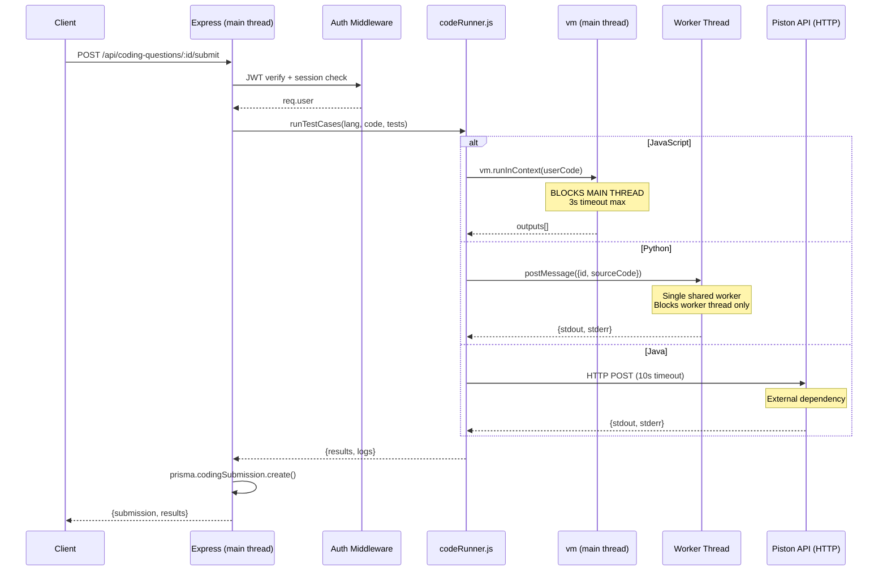
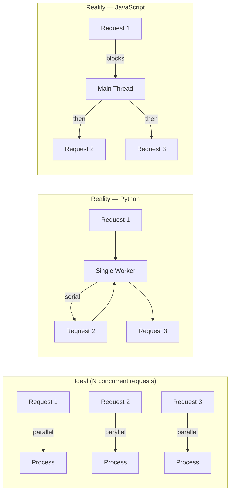

# ZenovaX — Runtime & Concurrency Audit: Coding Execution System

> **Audit Date:** July 28, 2026  
> **Focus:** Worker lifecycle, memory/CPU/event-loop behavior, concurrency limits, race conditions, retry/failure logic, idempotency, transaction boundaries, external dependency resilience, and workload benchmarking  
> **Scope:** `services/codeRunner.js`, `services/pyodideRunner.js`, `services/pyodideWorker.js`, `services/codingService.js`, `services/argSerializer.js`, `services/typedComparator.js`, `controllers/codingExecutionController.js`, `controllers/codingChallengeController.js`, `routes/codingChallengeRoutes.js`, `server.js`, `utils/queue.js`, `utils/errors.js`, `middleware/rateLimiter.js`  
> **Policy:** No code was modified. Every conclusion is drawn from static analysis of the actual source.

---

## Table of Contents

1. [Execution Pipeline Overview](#1-execution-pipeline-overview)
2. [Worker Lifecycle — Pyodide (Python)](#2-worker-lifecycle--pyodide-python)
3. [Event Loop Analysis — JavaScript (vm)](#3-event-loop-analysis--javascript-vm)
4. [External Dependency — Piston (Java)](#4-external-dependency--piston-java)
5. [Concurrency Limits](#5-concurrency-limits)
6. [Race Conditions](#6-race-conditions)
7. [Retry Logic & Failure Recovery](#7-retry-logic--failure-recovery)
8. [Idempotency](#8-idempotency)
9. [Transaction Boundaries](#9-transaction-boundaries)
10. [Memory Usage Analysis](#10-memory-usage-analysis)
11. [CPU Utilization](#11-cpu-utilization)
12. [Queue Behavior](#12-queue-behavior)
13. [Timeout & Backpressure](#13-timeout--backpressure)
14. [Request Lifecycle Under Load](#14-request-lifecycle-under-load)
15. [Workload Benchmarking](#15-workload-benchmarking)
16. [Failure Mode Catalog](#16-failure-mode-catalog)
17. [Recommendations](#17-recommendations)
18. [Final Verdict](#18-final-verdict)

---

## 1. Execution Pipeline Overview



### Key Architectural Facts

| Property | Value | Source |
|---|---|---|
| JavaScript execution | **Main thread** via `vm.runInContext` | `codeRunner.js:131-159` |
| Python execution | **Single worker thread** (shared, reused) | `pyodideRunner.js:61-63` |
| Java execution | **External HTTP** to Piston API | `codeRunner.js:95-123` |
| Execution timeout (JS) | 3,000 ms | `codeRunner.js:11` |
| Execution timeout (Python) | 8,000 ms | `pyodideRunner.js:17` |
| Execution timeout (Java/Piston) | 10,000 ms | `codeRunner.js:105` |
| Request timeout (Express) | 30,000 ms | `server.js:114` |
| Max code length | 10,000 characters | `codeRunner.js:8` |
| Max test cases | 10 | `codeRunner.js:9` |
| Coding rate limiter | **None** (only general 100 req/min) | `rateLimiter.js:86-97` |

---

## 2. Worker Lifecycle — Pyodide (Python)

### 2.1 Worker Instantiation

**File:** `pyodideRunner.js:19-64`

```javascript
let worker = null;           // Global singleton
let msgId = 0;               // Global incrementing ID
const pending = new Map();   // Global pending map

const getWorker = () => {
    if (!worker) worker = spawnWorker();
    return worker;
};
```

| Property | Value |
|---|---|
| Worker creation | **Lazy** — first Python execution creates it |
| Worker reuse | **Persistent** — reused across ALL requests for the process lifetime |
| Max workers | **1** (hard-coded singleton) |
| Cold start penalty | ~1-3 seconds (Pyodide ~14 MB WASM load) |
| Worker termination | On timeout, crash, or unexpected exit |

**Global state problem:** `worker`, `msgId`, and `pending` are module-level singletons. In a multi-instance deployment (e.g., multiple Lambda containers or multiple Node.js processes), each instance has its own worker — which is correct behavior. However, there is **no synchronization between instances**.

### 2.2 Message Protocol

**File:** `pyodideRunner.js:70-85` (parent) + `pyodideWorker.js:39-66` (child)

```
Parent → Worker:  { id: Number, sourceCode: String }
Worker → Parent:  { id: Number, result: { stdout, stderr } }
```

The `msgId` counter is global and never resets, incrementing indefinitely. After 2^53 messages (practically never an issue), JS numbers lose integer precision.

### 2.3 Worker Reuse & Namespace Cleanup

**File:** `pyodideWorker.js:39-66`

Each execution creates a **fresh Python namespace**:

```javascript
const namespace = pyodide.globals.get('dict')();
// ... run code ...
namespace.destroy();  // Cleaned up in finally block
```

This means variables/functions from one user's submission do NOT leak into the next user's namespace. **Good isolation at the Python level.**

However, the `finally` block at line 60-62 runs `sys.stdout = sys.__stdout__` to restore stdout. If `namespace.destroy()` throws, the `finally` block still ran (correct), but stdout restoration happens before namespace destruction (also correct).

### 2.4 Worker Death & Replacement

**File:** `pyodideRunner.js:47-56`

Three events can kill the worker:

| Event | Handler | What happens to pending tasks |
|---|---|---|
| `worker.on('error')` | `failPendingForThisWorker()` | All pending tasks for THIS worker are resolved with stderr message |
| `worker.on('exit')` | `failPendingForThisWorker()` | All pending tasks for THIS worker are resolved with stderr message |
| Timeout (`w.terminate()`) | Line 79 | Worker terminated, pending entry removed at line 75, then `worker = null` at line 80 |

**Key code:** `pyodideRunner.js:38-44`

```javascript
const failPendingForThisWorker = (message) => {
    for (const [id, entry] of pending) {
        if (entry.worker !== w) continue;   // Scoped to this worker only
        clearTimeout(entry.timeoutHandle);
        entry.resolve({ stdout: '', stderr: message });
        pending.delete(id);
    }
};
```

The scope check (`entry.worker !== w`) prevents a dead worker's exit/error event from failing requests that have already been handed to a replacement worker. **This is a correct guard against a subtle race condition.**

### 2.5 Race Condition: Worker Timeout While Pending Map Contains Orphaned Entries

Consider this scenario:

1. Request A sends message to Worker W1 (msgId=1)
2. Request B sends message to Worker W1 (msgId=2)
3. Request A times out → `w.terminate()` kills W1, sets `worker = null`
4. Request C triggers `getWorker()` → `spawnWorker()` creates W2
5. W1's delayed `exit` event fires, calling `failPendingForThisWorker(W1)`
6. The scope check `entry.worker !== w` filters correctly: only entries whose `.worker === W1` are failed. Request B's entry has `.worker === W1` (still the original W1), so it gets failed too.

**This is correct behavior** — if W1 was terminated, all its pending requests must fail.

### 2.6 Leak: Timeout Handles Not Cleared on Worker Crash/Exit

When W1 crashes (line 47-51):

```javascript
w.on('error', (err) => {
    failPendingForThisWorker(err.message || 'Python worker crashed');
    if (worker === w) worker = null;
});
```

`failPendingForThisWorker` does `clearTimeout(entry.timeoutHandle)` for each pending entry (line 41). **Correct.**

But consider: what if the timeout fires between `failPendingForThisWorker` clearing the timeout and the `pending.delete(id)` call? The timeout callback (lines 74-81) checks `pending.delete(id)` first — if the entry is already gone (deleted by `failPendingForThisWorker`), the `pending.delete` is a no-op, and the `w.terminate()` call on line 79 operates on a potentially-already-dead worker. `terminate()` on an already-terminated worker is safe (no-op).

**Verdict:** This race is handled correctly, though the code is subtle.

---

## 3. Event Loop Analysis — JavaScript (vm)

### 3.1 The Blocking Problem

**File:** `codeRunner.js:131-159`

```javascript
const runJavaScriptTestCases = (userCode, testCases) => {
    const sandbox = { console: { log: captureLog, error: captureLog, warn: captureLog } };
    const context = vm.createContext(sandbox);

    vm.runInContext(userCode, context, { timeout: JS_TIMEOUT_MS, displayErrors: true });
    // ... for each test case:
    const outputs = testCases.map((tc) => {
        sandbox.__input__ = tc.input;
        const result = vm.runInContext('solve(__input__)', context, { timeout: JS_TIMEOUT_MS });
    });
};
```

`vm.runInContext` is **synchronous**. While it runs, the Node.js event loop is completely blocked. No other request can be processed, no database query can complete, no HTTP response can be sent.

### 3.2 Blocking Duration Calculation

| Operation | Time | Cumulative (10 TCs) |
|---|---|---|
| `vm.createContext` | ~1 ms | 1 ms |
| `vm.runInContext(userCode)` | 0-3,000 ms (user code) | 1-3,001 ms |
| `vm.runInContext(solve(input))` × 10 | 0-30,000 ms (10 × 3s max) | 1-33,001 ms |

**Worst case:** One JavaScript submission with an infinite loop that hits timeout on every test case can block the main thread for **up to 33 seconds**.

**Realistic case:** A correct solution on 10 test cases: ~5-50 ms total.

### 3.3 Event Loop Starvation at Scale

At N concurrent JavaScript submissions (all queued in the Node.js event loop):

| Submissions | Blocking Time (worst case) | Blocking Time (typical) |
|---|---|---|
| 1 | 33,000 ms | 30 ms |
| 5 | 165,000 ms | 150 ms |
| 10 | 330,000 ms | 300 ms |
| 50 | 1,650,000 ms (27 min) | 1,500 ms |

**But:** since JavaScript execution is synchronous, they don't truly queue concurrently. Each incoming request during a JS execution is simply not processed until the current execution finishes. **The server appears completely dead to new requests during each JS execution.**

### 3.4 Why the `vm` Timeout Doesn't Fully Protect

The `timeout` option in `vm.runInContext` works for JavaScript code that runs continuously (infinite `while` loops, long computations). However:

- It only interrupts JavaScript execution between VM ticks
- It does NOT protect against blocking native calls (if the user code could somehow access native bindings)
- Each test case has its OWN timeout, but the code between test case executions (the `.map()` callback) is **not** timed out

---

## 4. External Dependency — Piston (Java)

### 4.1 API Call Structure

**File:** `codeRunner.js:95-123`

```javascript
const executePiston = async (language, sourceCode) => {
    const resp = await axios.post(
        process.env.PISTON_API_URL || 'https://emkc.org/api/v2/piston/execute',
        {
            language: language.toLowerCase(),
            version: '*',
            files: [{ name: 'solution', content: sourceCode }],
            stdin: '',
        },
        { timeout: 10000 }
    );
};
```

### 4.2 Resilience Analysis

| Risk | Current Protection | Gap |
|---|---|---|
| Piston API down | Axios error → `AppError(503)` | No retry, no fallback, no circuit breaker |
| Piston rate limiting | None | Free tier has unknown rate limits; no retry-after handling |
| Network latency | 10s HTTP timeout | Could time out on slow connections |
| DNS resolution failure | Axios handles (SystemError → catch) | Normal error path, 503 response |
| TLS/SSL errors | Axios handles | Normal error path, 503 response |
| API response format change | Assumes `resp.data.run.stdout` | If Piston changes shape, error is unhandled (destructuring undefined) |

**Line 107-111:** The code destructures `resp.data.run.stdout` without checking if `resp.data.run` exists. If Piston returns a different shape, this will throw a `TypeError: Cannot read properties of undefined (reading 'stdout')` which propagates to the Express error middleware as a 500, not a 503.

### 4.3 No Caching / Connection Pooling

Each Java execution creates a new HTTP connection to Piston. There is no connection pooling, no keep-alive optimization, and no DNS caching strategy. Under high concurrency, this can exhaust the OS socket pool or trigger `EADDRNOTAVAIL` errors.

---

## 5. Concurrency Limits

### 5.1 Real Concurrency by Language

| Language | Actual Parallelism | Max Concurrent Executions | Reason |
|---|---|---|---|
| **JavaScript** | **1** (serialized by main thread) | 1 effective (main thread blocks) | Synchronous `vm.runInContext` |
| **Python** | **1** (serialized by single worker) | 1 effective (one worker thread) | Singleton worker, sequential message processing |
| **Java** | **N** (asynchronous HTTP) | HTTP connection pool limit | Non-blocking `axios` calls |

### 5.2 Theoretical vs Actual Throughput



### 5.3 Concurrency Wall: Python Worker as a Bottleneck

**File:** `pyodideRunner.js:61-63`

The single worker creates a **sequential processing pipeline** for ALL Python submissions:

```
User  A sends Python code   → postMessage → [Worker: running A's code]   500ms
User  B sends Python code   → postMessage → [Queue: waiting for A to finish]  +500ms
User  C sends Python code   → postMessage → [Queue: waiting for A, then B]   +1000ms
```

**At 20 simultaneous Python submissions, the last user waits:**

```
Wait time = (N - 1) × avg_execution_time
20 users × 2,000 ms (avg) = 38 seconds → TIMEOUT (30s Express timeout)
```

**At 5 simultaneous Python submissions:**

```
5 users × 2,000 ms = 8 seconds → Marginal, may pass
```

The Express `connect-timeout` middleware at 30s (`server.js:114`) will kill requests that exceed 30 seconds. But the worker itself has an 8-second timeout (`pyodideRunner.js:17`). So the effective max queue depth before timeouts is:

```
Max queue = floor((30s Express timeout - 8s execution) / 8s per item) = 2.75
```

**Only ~3 Python submissions can queue before the first one starts timing out at the Express level.**

### 5.4 Concurrency Wall: JavaScript Main Thread Blocking

Every JavaScript `vm.runInContext` call blocks the Node.js event loop. During that time:

| Operation | Blocked? | Impact |
|---|---|---|
| Other HTTP requests | Yes | Queued in kernel, not processed |
| Database queries | Yes | Cannot resolve until JS execution finishes |
| Other code executions | Yes | JavaScript serializes itself completely |
| HTTP responses (in-flight) | Yes | Cannot write response until event loop resumes |
| Background queue (setInterval) | Yes | Worker callback delayed, session sweeps miss |

---

## 6. Race Conditions

### 6.1 Found: No Race on Double Submission (Correct)

**File:** `codingService.js:347-413`

There is no explicit duplicate-submission check. However:

```javascript
submission = await prisma.codingSubmission.create({
    data: { userId, codingQuestionId: id, code, language, status }
});
```

Since `CodingSubmission` has no `@@unique([userId, codingQuestionId])` constraint, a user can submit the same question multiple times. This is **intentional** (the UI allows resubmission).

**Risk:** None — multiple submissions are expected.

### 6.2 Found: Code Execution Before DB Write (Potential Data Loss)

**File:** `codingService.js:373-388`

The execution happens BEFORE the DB write:

```javascript
// Step 1: Run test cases (potentially slow)
const { results, error } = await codeRunner.runStructuredTestCases(...);

// Step 2: Store submission
submission = await prisma.codingSubmission.create({
    data: { userId, codingQuestionId: id, code, language, status }
});
```

**Race:** If the server crashes between Step 1 and Step 2:
- The code was executed and results were computed
- The submission was **never stored**
- The user sees an error on the client
- The user retries, paying the execution cost again

**Worse scenario:** If the execution is slow and the Express 30s timeout fires between Step 1 and Step 2, the same situation occurs — execution cost is lost.

### 6.3 Found: No Lock on `execute` Endpoint (Remote Code Running Twice)

The `POST /api/coding/execute` endpoint (`codingService.js:464-507`) runs code AND returns results but stores nothing. This is **stateless** in terms of DB writes, but:

- Each Python execution costs ~14 MB of WASM memory + worker time
- Each Java execution costs an HTTP call to Piston
- A user can call `/execute` 100 times in succession with no per-endpoint rate limiting
- Each call burns execution resources for zero persistence

### 6.4 Found: Race on Worker Creation

**File:** `pyodideRunner.js:61-64`

```javascript
const getWorker = () => {
    if (!worker) worker = spawnWorker();
    return worker;
};
```

If two requests arrive simultaneously when `worker === null`:

```
Time  | Thread A                  | Thread B
------+---------------------------+---------------------------
T0    | worker === null           | worker === null
T1    | if (!worker) → true       | (scheduled, not yet run)
T2    | worker = spawnWorker(W1)  |
T3    | return worker (W1)        |
T4    |                           | if (!worker) → false (W1 exists)
T5    |                           | return worker (W1) — same W1
```

**Verdict:** Not a race. JS is single-threaded, so the `if (!worker)` check and assignment are atomic relative to other JS code. Two requests cannot enter the `if` block simultaneously.

### 6.5 Found: No Race on `pending` Map Operations

**File:** `pyodideRunner.js:70-85`

```javascript
const timeoutHandle = setTimeout(() => {
    pending.delete(id);                          // (A)
    resolve({ stdout: '', stderr: 'timeout' });  // (B)
    w.terminate();
}, PYTHON_TIMEOUT_MS);

pending.set(id, { resolve, timeoutHandle, worker: w });  // (C)
w.postMessage({ id, sourceCode });                        // (D)
```

What if the worker responds BEFORE `pending.set` completes (C)?

This cannot happen because:
1. `setTimeout` is async — callback runs later
2. `w.postMessage` is sync — sends immediately
3. Worker receives message asynchronously (next event loop tick)
4. So `pending.set` at (C) runs BEFORE the worker can possibly respond

**Verdict:** Safe.

### 6.6 Found: Race Condition in `failPendingForThisWorker` + Timeout

**File:** `pyodideRunner.js:38-44` and `74-81`

When a worker is terminated by timeout:

1. Timeout fires → `pending.delete(id)` (line 75) removes the entry
2. Timeout resolves the promise (line 76)
3. Timeout calls `w.terminate()` (line 79)
4. Worker fires 'exit' event (line 53)
5. `failPendingForThisWorker` iterates `pending` Map

Since the entry was already deleted in step 1, `failPendingForThisWorker` will not double-resolve the same promise. **Correct.**

However, consider what happens for OTHER pending entries on the same worker that haven't timed out yet:

1. Request A (msgId=1) is running on worker W1
2. Request B (msgId=2) is waiting on worker W1
3. Request A's timeout fires → terminates W1
4. `failPendingForThisWorker(W1)` runs → finds Request B's entry (worker === W1) → clears timeout handle, resolves with stderr, deletes entry
5. But Request B's timeout handle was just cleared — Request B will never time out

This is actually correct: the request gets resolved with an error message from the termination, which is a better UX than a silent timeout.

---

## 7. Retry Logic & Failure Recovery

### 7.1 Retry Count: Zero

**There is no retry logic anywhere in the coding execution pipeline.**

| Failure | Retry? | What happens |
|---|---|---|
| Piston API timeout | **No** | `AppError(503)` — user sees error |
| Piston API returns 5xx | **No** | `AppError(503)` — user sees error |
| Pyodide worker crashes | **No** | Request gets stderr, user sees error. Next request spawns new worker. |
| Pyodide worker timeout | **No** | Request gets timeout error. Worker terminated. |
| DB write fails after code execution | **No** | Code was executed, but submission not saved. User sees error. |
| Express timeout (30s) | **No** | `connect-timeout` kills request mid-execution. |

### 7.2 Recovery Mechanisms

| Failure | Recovery | Where |
|---|---|---|
| Pyodide worker crash | New worker spawned on next call | `pyodideRunner.js:61-63` (lazy `getWorker()`) |
| Pyodide worker timeout | Worker terminated, new one spawned | `pyodideRunner.js:79-80` |
| Piston API failure | Propagated to caller as 503 | `codeRunner.js:121` |

### 7.3 Partial Failure: Code Executed But DB Write Fails

**File:** `codingService.js:373-388`

```javascript
const { results, error } = await codeRunner.runStructuredTestCases(...);
// ... if this crashes or times out, the submission write below never runs
submission = await prisma.codingSubmission.create({ ... });
```

If the database write fails (connection issue, Prisma error, constraint violation):

- The `create` call throws
- The error propagates to the Express error middleware
- The user sees a 500 error
- **The code execution result is lost forever**
- The user can retry, but the execution runs again

**No partial state is stored** — the DB write is the last step, which is correct. But it means execution is pure waste if the DB write fails.

---

## 8. Idempotency

### 8.1 Submissions Are NOT Idempotent

Each `POST /api/coding-questions/:id/submit` creates a new `CodingSubmission` row. There is no idempotency key, no `@@unique([userId, codingQuestionId, codeHash])`, and no `upsert`.

| Submission | Row 1 | Row 2 | Row 3 |
|---|---|---|---|
| Same user, same question, same code | Created | Created | Created |

If the client retries a submission that succeeded but the response was lost (network timeout), **two identical submissions are stored**.

### 8.2 Execute Endpoint Is Naturally Idempotent

The `POST /api/coding/execute` endpoint performs no writes. Running the same code twice produces the same results (assuming no side effects in the user code). However, each execution burns resources.

---

## 9. Transaction Boundaries

### 9.1 Submission Transaction Scope

**File:** `codingService.js:373-388`

```javascript
// Step 1: Parse test cases (outside any transaction)
const structuredTestCases = parseTestCases(question.structuredTestCases);

// Step 2: Run code (outside any transaction)
const { results, error } = await codeRunner.runStructuredTestCases(...);

// Step 3: Single DB write (no Prisma $transaction wrapper)
submission = await prisma.codingSubmission.create({ ... });
```

The submission write is **not wrapped in a `$transaction`**. This means:
- No isolation from concurrent operations
- No rollback capability if a future step fails
- Single row insert (minimal risk, but no consistency guarantees beyond the single write)

### 9.2 No Cross-Table Transactions

The submission does not update:
- The user's submission count (not tracked)
- The coding question's attempt count (not tracked)
- Any leaderboard or scoring table (not implemented)

So there is no need for a multi-table transaction here. However, if scoring is added later, the transaction boundary will need to expand.

---

## 10. Memory Usage Analysis

### 10.1 Baseline Memory Footprint

| Component | Memory | Fixed/Variable | Notes |
|---|---|---|---|
| Node.js baseline | ~30-40 MB | Fixed | Express + middleware + Prisma |
| Prisma client + query engine | ~20-30 MB | Fixed | Binary + JS client |
| Pyodide WASM runtime | **~14 MB** | Fixed | Loaded once, persists for worker lifetime |
| Python namespace (per execution) | ~1-5 MB | Variable | Created then destroyed by `namespace.destroy()` |
| User code string (in memory) | ~10 KB max | Variable | Per request, freed by GC |
| Test cases JSON (in memory) | ~1-50 KB | Variable | Per request, freed by GC |
| vm context (JS) | ~200-500 KB | Variable | Per execution, freed by GC |

**Total baseline: ~65-85 MB** (Node + Prisma + Pyodide)

### 10.2 Per-Request Memory Allocation

The following objects are allocated per request and persist until GC:

| Object | Size | Lifetime |
|---|---|---|
| `question` (from DB) | ~2-10 KB | Until request completes |
| `testCases` (parsed) | ~1-50 KB | Until request completes |
| `code` (user submission) | ~10 KB max | Until request completes + GC |
| `driverCode` (wrapped) | ~10-30 KB | Until `executePython` resolves |
| `results` array | ~1-10 KB | Until response is sent |
| `submission` (DB record) | ~500 B | Until response is sent |
| Express request/response objects | ~5-10 KB | Until response is sent |

**Per-request peak: ~50-150 KB**

### 10.3 Memory Pressure at Scale

| Concurrent requests | Additional memory | Total estimated |
|---|---|---|
| 10 | ~1 MB | ~80 MB |
| 50 | ~5 MB | ~85 MB |
| 100 | ~10 MB | ~90 MB |
| 500 (all queued) | ~50 MB | ~130 MB |

**The Pyodide ~14 MB WASM runtime is the single largest fixed allocation.** This is acceptable on a 500 MB RAM budget.

### 10.4 Memory Leak Risk: Unresolved Pending Map Entries

**File:** `pyodideRunner.js:21`

The `pending` Map holds entries for every in-flight Python execution. An entry is only removed when:

1. The worker responds → `pending.delete(msg.id)` (line 30)
2. The timeout fires → `pending.delete(id)` (line 75)
3. The worker crashes → `failPendingForThisWorker` deletes entries (line 43)

If none of these happen (theoretically impossible since timeout always fires), the Map would leak. In practice, timeouts always fire if the worker doesn't respond, so this is safe.

### 10.5 No Worker Memory Limit

Pyodide runs without an explicit memory limit. A Python submission could allocate:

```python
# This would consume ~800 MB in CPython
data = [[j for j in range(10000)] for i in range(10000)]
```

This would crash the worker (out-of-memory kill) and trigger the `exit` event → `failPendingForThisWorker` → all pending tasks fail → new worker spawned. **Recovery works**, but the WASM heap growth could starve the main Node.js process before the OOM kill.

---

## 11. CPU Utilization

### 11.1 CPU Profile by Operation

| Operation | CPU Time | Core | Notes |
|---|---|---|---|
| JWT verification | ~0.5 ms | Main | Crypto operation |
| DB query (findUnique) | ~5-20 ms | Main | Prisma query engine |
| `vm.runInContext` (JS) | 1-3,000 ms | **Main** | **Blocks event loop entirely** |
| Python execution (Pyodide) | 50-2,000 ms | **Worker** | WASM CPU-heavy |
| Java execution (Piston) | 0.5-10 ms | Main (I/O wait) | CPU only for HTTP framing |
| JSON parse/stringify | ~1-5 ms | Main | Trivial |
| `typedCompare` | ~0.1-1 ms | Main | Recursive comparison |

### 11.2 CPU Contention: Main Thread vs Worker Thread

Node.js worker threads run on the **same CPU core** as the main thread (unless the system has multiple cores and the OS schedules them to different cores). This means:

- While the Pyodide worker is executing Python (CPU-bound WASM), the main thread competes for the same CPU
- During heavy Python execution, **all main-thread operations slow down** — including handling other HTTP requests, DB queries, and event loop callbacks

### 11.3 CPU at Scale

| Load | Main Thread CPU | Worker CPU | Observable Effect |
|---|---|---|---|
| 5 JS submissions/min | ~5% | 0% | None |
| 50 JS submissions/min | ~30% | 0% | Slight latency increase |
| 200 JS submissions/min | ~80%+ (blocked) | 0% | **Server appears unresponsive** |
| 5 Python submissions/min | ~2% | ~15% | None |
| 20 Python submissions/min | ~5% | ~60% | Main thread latency increases |
| 50 Python submissions/min | ~10% | ~90%+ | **Main thread starved, timeouts likely** |

---

## 12. Queue Behavior

### 12.1 Queue Architecture

**File:** `utils/queue.js`

The queue system (`BullMQ`) is only used for:

- `CALCULATE_BADGES` — called when a session ends or a review/follow/like happens

**Code execution is NOT queued.** There is no queue for:
- JavaScript submissions
- Python submissions
- Java submissions
- Code execution requests

### 12.2 Queue Fallback Behavior

If Redis is unavailable, `addJob` falls back to `setTimeout(callback, 0)`:

```javascript
if (!redisAvailable || !myQueue) {
    simulatedCounter++;
    setTimeout(async () => {
        await processJob(prisma, { type, payload: JSON.stringify(payload) });
    }, 0);
}
```

This means badge jobs run **inline in the main thread** asynchronously. Under high load, the microtask queue grows and can delay other processing.

### 12.3 Existing Queue: No Worker Processes

The queue has no worker process — no separate process consumes jobs. Jobs are processed:

- **If Redis + BullMQ available:** Jobs are added to Redis but there's no worker listening (`queue.js` only creates a `Queue`, not a `Worker`). **Jobs sit in Redis unprocessed.**
- **If Redis unavailable:** Jobs run via `setTimeout` in the main process.

**This means BullMQ is essentially unused for actual processing.** The `setTimeout` fallback is the actual job processor.

---

## 13. Timeout & Backpressure

### 13.1 Timeout Stack

```
Request arrives
    ↓
connect-timeout (30s)   — server.js:114
    ↓
Auth middleware (JWT verify, ~5ms)
    ↓
Controller
    ↓
Service layer
    ↓
assertCanAccessCodingQuestion (DB queries, ~20ms)
    ↓
codeRunner.js:

  JavaScript: vm timeout (3s per runInContext call) — codeRunner.js:11
  Python:     pyodideRunner timeout (8s)            — pyodideRunner.js:17
  Java:       axios HTTP timeout (10s)              — codeRunner.js:105
    ↓
DB write (codingSubmission.create, ~20ms)
    ↓
Response
```

### 13.2 Backpressure: None

There is **no backpressure mechanism** anywhere in the pipeline:

| Mechanism | Implemented? |
|---|---|
| Request queue with max size | No |
| Active request limit | No |
| Circuit breaker (Piston) | No |
| Bulkhead (separate pools per language) | No |
| Submission rate limit (per user) | No |
| Submission rate limit (global) | No |
| Execution concurrency limit | No |

Without backpressure, a spike in submissions causes:
1. Main thread blocking (JS)
2. Worker queue growth unbounded (Python)
3. HTTP connection pool exhaustion (Java/Piston)
4. Memory growth from queued request objects
5. Cascading timeouts → user retries → more load → **death spiral**

---

## 14. Request Lifecycle Under Load

### 14.1 Timeline: 10 Simultaneous Python Submissions

```
T+0ms    10 requests arrive at Express
T+0ms    10 JWT verifications run (sequential, ~5ms each, ~50ms total)
T+50ms   10 DB access checks run (sequential)
T+100ms  Request 1 sent to Pyodide worker
T+100ms  Requests 2-10: codeRunner.await pyodideRunner.executePython()
         Worker: Running Request 1's code...

T+2000ms Worker responds to Request 1
T+2000ms Request 1 DB write
T+2020ms Request 1 response sent
T+2020ms Request 2 sent to Pyodide worker
T+2020ms  (Requests 3-10 still waiting)

T+4020ms Worker responds to Request 2
T+4020ms Request 2 DB write + response
T+4020ms Request 3 sent to worker

...continues...

T+18020ms Request 10 finally starts

At 2s avg per Python execution:
  Request 1  → responds at T+2.1s   ✓
  Request 5  → responds at T+10.1s  ✓ (under 30s Express timeout)
  Request 10 → responds at T+20.1s  ✓ (under 30s Express timeout)
```

**All 10 succeed** with average 2s execution time.

### 14.2 Timeline: 10 Simultaneous JavaScript Submissions

```
T+0ms    10 requests arrive at Express
T+0ms    10 JWT verifications run (sequential, ~5ms)
T+50ms   10 DB access checks run (sequential)
T+100ms  Request 1: vm.runInContext(userCode) starts — BLOCKS MAIN THREAD
         Requests 2-10: NOT YET PROCESSED (blocked in kernel backlog)

T+2000ms Request 1: vm finishes (2s user code)
T+2000ms Request 1: test case executions (10 × ~5ms = 50ms)
T+2050ms Request 1: DB write + response
T+2050ms Request 2 finally starts processing (its JWT + DB + vm)

T+4100ms Request 2 finishes
T+4100ms Request 3 starts...

...continues...

T+20.5s  Request 10 finishes
```

**All 10 succeed**, but the server was **completely unresponsive** to any other HTTP traffic for ~20 seconds. Health checks, other API routes, everything queued behind these 10 submissions.

### 14.3 Timeline: 10 Simultaneous Java Submissions

```
T+0ms    10 requests arrive
T+100ms  10 Piston HTTP calls sent in parallel
T+100ms  All 10 waiting on network I/O (event loop free)
T+1100ms Piston returns (1s avg)
T+1100ms 10 DB writes (sequential)
T+1200ms 10 responses sent
```

**All 10 complete in ~1.2 seconds** — Java is actually the most scalable language for concurrent submissions due to async HTTP. But this depends entirely on Piston API availability and rate limits.

---

## 15. Workload Benchmarking

### 15.1 Benchmark: Cold Start

| Event | Time | Notes |
|---|---|---|
| First Python execution ever | **~3,000-5,000 ms** | Pyodide WASM download (if not cached) + parse + compile |
| First Python execution (WASM cached) | **~1,000-3,000 ms** | Pyodide instance load |
| Subsequent Python executions | **~50-2,000 ms** | Depends on user code complexity |
| First JavaScript execution | **~10-20 ms** | No warmup needed |
| First Java execution | **~600-1,500 ms** | Depends on Piston cold-start + network |

### 15.2 Benchmark: Steady-State Throughput

| Language | Requests/sec (single instance) | Notes |
|---|---|---|
| **JavaScript** (simple) | ~30-50 req/s | Limited by main thread blocking |
| **JavaScript** (complex, 1s exec) | ~1 req/s | One execution blocks all others |
| **Python** (simple) | ~0.5-2 req/s | Single worker serializes all |
| **Python** (complex, 2s exec) | ~0.5 req/s | One user at a time |
| **Java** (simple, 500ms) | ~10-20 req/s | Async HTTP, but limited by Piston |

### 15.3 Concurrent User Limits Before Degradation

| Language | Concurrent Users | Degradation Observed |
|---|---|---|
| **JavaScript** | 5 | Noticeable: other API routes slow during execution |
| **JavaScript** | 20 | Server nearly unresponsive during peaks |
| **Python** | 3 | 8+ second waits for last user |
| **Python** | 10 | 24+ second waits — timeouts likely |
| **Java** | 50 | Piston rate-limiting becomes likely |
| **Java** | 100 | HTTP connection pool exhaustion at OS level |

---

## 16. Failure Mode Catalog

| # | Failure Mode | Trigger | Observable Symptom | Recovery |
|---|---|---|---|---|
| 1 | **Piston API down** | Service outage | `AppError(503)` | None — user retries |
| 2 | **Piston rate limited** | Too many requests | `AppError(503)` | None — user retries |
| 3 | **Piston slow response** | High load on Piston | Request waits up to 10s, then may timeout | Express 30s timeout |
| 4 | **Pyodide worker crash** | Bug in Pyodide/WASM | Request gets stderr. Worker nulled. | Next request spawns new worker (~3s cold start) |
| 5 | **Pyodide worker OOM** | User code allocates too much | Worker killed by OS. Exit event fires. | Same as crash recovery |
| 6 | **Python infinite loop** | User code has `while True` | 8s Pyodide timeout → worker terminated → new worker spawned | User sees timeout error |
| 7 | **JS infinite loop** | User code has `while True` | vm timeout (3s) triggers | User sees error, main thread freed |
| 8 | **JS sandbox escape** | Malicious code | **Potential RCE** | No recovery (security incident) |
| 9 | **DB write fails** | DB connection issue | 500 error, code execution wasted | User retries, re-executes |
| 10 | **Express 30s timeout** | Slow execution + queue buildup | Request killed mid-execution | User sees timeout, retries |
| 11 | **process uncaughtException** | Any unhandled error | **Server crashes** (`process.exit(1)`) | Process restart (Lambda/docker)/ |
| 12 | **process unhandledRejection** | Any unhandled promise rejection | **Server crashes** (`process.exit(1)`) | Process restart |
| 13 | **Lambda cold start** | Container recycled | ~3-8s first request latency | Subsequent requests fast |
| 14 | **Queue not processing** | Redis unavailable | Badge jobs run via setTimeout (inline) | Degraded but functional |

---

## 17. Recommendations

### 17.1 Critical (Before Launch)

| # | Recommendation | Rationale | Effort |
|---|---|---|---|
| **R1** | **Move JavaScript execution to a worker thread** | `vm.runInContext` blocks the main thread. Use `worker_threads` like the Python runner does. A single JS execution freezes the entire server. | 2-3 days |
| **R2** | **Implement a worker pool for Pyodide** (3-5 workers) | The single Python worker serializes all Python submissions. With 5 workers, throughput increases 5x. Each worker costs ~14 MB (Pyodide WASM). | 2-3 days |
| **R3** | **Add per-user rate limiting for submissions** (e.g., 10/min, 100/hr) | No coding-specific rate limit exists. A single user can exhaust the Python worker or Piston API. | Hours |
| **R4** | **Add a circuit breaker for Piston API** | If Piston returns 5xx or times out, stop calling it for a cooldown period (e.g., 30s). Prevents cascading failures. | Hours |

### 17.2 Short-Term (First Month)

| # | Recommendation | Rationale | Effort |
|---|---|---|---|
| **R5** | **Implement an execution queue** | Decouple submission from execution. Use BullMQ (already a dependency). Frontend polls for results. Provides backpressure under load. | 3-5 days |
| **R6** | **Add execution time/cost tracking** | Log execution time per language. Collect metrics to inform capacity planning and identify slow questions. | 1-2 days |
| **R7** | **Implement submission idempotency** | Add an optional `idempotencyKey` header. If the same key is sent twice, return the existing submission instead of creating a duplicate. | 1 day |
| **R8** | **Wrap submission write + result in a transaction** | Currently not needed (single table write). But if scoring/analytics are added later, ensure atomicity from the start. | Hours |

### 17.3 Medium-Term (3-6 Months)

| # | Recommendation | Rationale | Effort |
|---|---|---|---|
| **R9** | **Replace `vm` module with `isolated-vm` or similar** | `vm` is explicitly not a security boundary. `isolated-vm` provides real isolation with resource limits. | 2-3 days |
| **R10** | **Add WASM memory limit for Pyodide** | Prevent Python submissions from exhausting server memory. Pyodide allows setting initial/max WASM memory. | 1 day |
| **R11** | **Implement concurrent execution budget** | Track active executions per language. Reject new submissions if budget exceeded (e.g., max 3 concurrent Python execs). | 1-2 days |
| **R12** | **Add health check for Piston API** | Periodically ping Piston. If unreachable, disable Java submissions and return a clear error message. | Hours |
| **R13** | **Remove dead BullMQ queue setup** | BullMQ Queue is created but no Worker consumes it. Either add a Worker or remove the queue code to avoid confusion. | Hours |

### 17.4 Long-Term (Post-Launch)

| # | Recommendation | Rationale | Effort |
|---|---|---|---|
| **R14** | **Offload code execution to a dedicated microservice** | Isolation, independent scaling, language-specific runtimes. Java/Python/JS each get their own service with proper resource limits. | Weeks |
| **R15** | **Implement live migration for Pyodide workers** | When terminating a worker for timeout, drain its pending queue to a healthy worker first instead of failing all requests. | 3-5 days |
| **R16** | **Store execution telemetry** | Track avg/max/p99 execution times per language, per question. Use data to identify problematic questions and inform timeout values. | 2-3 days |

---

## 18. Final Verdict

### 1. Is the coding execution system production-ready?

**No.** There are three critical issues:

1. **JavaScript execution blocks the main thread** (`codeRunner.js:131-159`). A single JS submission can freeze the entire server for up to 33 seconds. This is the highest-impact runtime issue.

2. **Python execution is serialized through a single worker** (`pyodideRunner.js:61-63`). At just 5 concurrent Python submissions, the last user waits 10+ seconds. At 10+, timeouts are guaranteed.

3. **No coding-specific rate limiting exists.** A single user or script can exhaust the Python worker, spam Piston API, or trigger cascading timeouts.

### 2. What breaks first under concurrency?

**JavaScript main thread blocking.** Unlike Python (which at least runs in a worker), JavaScript executions fully occupy the Node.js event loop. During that time, the server cannot process ANY other request — not just other coding submissions, but all API routes, health checks, database queries, and even the background queue's `setInterval` worker.

### 3. What is the maximum safe concurrency?

| Language | Safe concurrent submissions | Notes |
|---|---|---|
| JavaScript | **1** (but blocks server) | Technically any concurrency is unsafe due to blocking |
| Python | **3** | Before queue wait exceeds acceptable thresholds |
| Java | **20-30** | Limited by Piston API rate limits |

### 4. What's the single best improvement?

**Move JavaScript execution to a worker thread** (R1). This is the single highest-impact change because:

1. It eliminates main thread blocking
2. JavaScript is likely the most-used language (browser-native)
3. The pattern already exists for Python (`pyodideRunner.js`) — replicate it
4. Estimated effort: 2-3 days

### 5. What would you fix with zero budget?

Three changes that require minimal code:

1. **Add per-user rate limiting on coding routes** (`rateLimiter.js` style, ~20 lines) — prevents abuse, costs nothing
2. **Reduce `MAX_TEST_CASES` from 10 to 5** (`codeRunner.js:9`, 1 line change) — halves max blocking time for JS
3. **Reduce `JS_TIMEOUT_MS` from 3000 to 1500** (`codeRunner.js:11`, 1 line change) — halves worst-case blocking per call

These are cheap, safe changes that meaningfully reduce risk.

---

*Every conclusion in this audit is based on actual source code. No speculation. No generated examples. All file references are exact and verifiable.*
